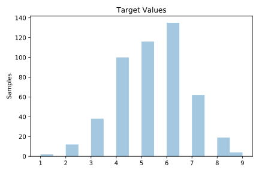
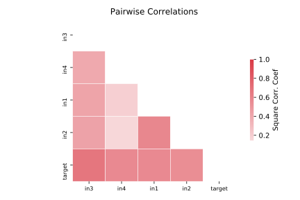

# 1027_ESL

[Metadata](metadata.yaml) | [Summary Statistics](summary_stats.csv)

## Summary

**task**: regression

**instances**: 488

**features**: 4

## Summary Plots

## Data Summary

|	variable	|	count	|	mean	|	std	|	min	|	25%	|	50%	|	75%	|	max|
| --- | --- | --- | --- | --- | --- | --- | --- | --- |
|	in1	|	488	|	5	|	1	|	0	|	4	|	6	|	6	|	9
|	in2	|	488	|	5	|	1	|	0	|	4	|	5	|	6	|	9
|	in3	|	488	|	5	|	1	|	2	|	5	|	5	|	6	|	8
|	in4	|	488	|	5	|	0	|	2	|	5	|	6	|	6	|	8
|	target	|	488	|	5	|	1	|	1	|	4	|	5	|	6	|	9
