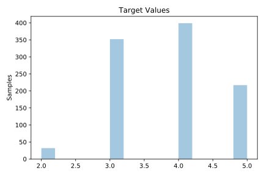
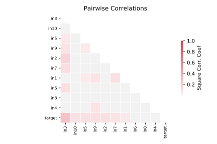

# 1028_SWD

[Metadata](metadata.yaml) | [Summary Statistics](summary_stats.csv)

## Summary

**task**: regression

**instances**: 1000

**features**: 10

## Summary Plots

## Data Summary

|	variable	|	count	|	mean	|	std	|	min	|	25%	|	50%	|	75%	|	max|
| --- | --- | --- | --- | --- | --- | --- | --- | --- |
|	In1	|	1000	|	1	|	0	|	1	|	1	|	2	|	3	|	3
|	In2	|	1000	|	2	|	0	|	1	|	2	|	2	|	3	|	3
|	In3	|	1000	|	2	|	1	|	1	|	1	|	2	|	3	|	4
|	In4	|	1000	|	1	|	0	|	1	|	1	|	2	|	3	|	3
|	In5	|	1000	|	2	|	1	|	1	|	2	|	2	|	3	|	4
|	In6	|	1000	|	1	|	0	|	1	|	1	|	1	|	2	|	2
|	In7	|	1000	|	1	|	0	|	1	|	1	|	2	|	2	|	3
|	In8	|	1000	|	2	|	0	|	1	|	1	|	2	|	3	|	3
|	In9	|	1000	|	2	|	0	|	1	|	1	|	2	|	3	|	3
|	In10	|	1000	|	2	|	0	|	1	|	1	|	2	|	3	|	3
|	target	|	1000	|	3	|	0	|	2	|	3	|	4	|	4	|	5
