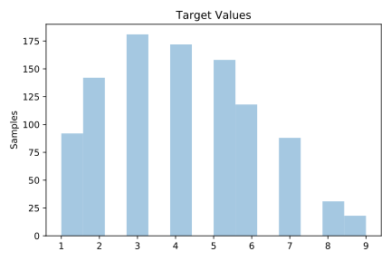
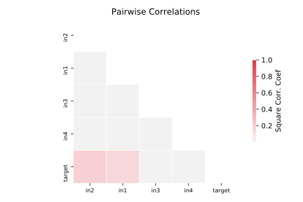

# 1030_ERA

[Metadata](metadata.yaml) | [Summary Statistics](summary_stats.csv)

## Summary

**task**: regression

**instances**: 1000

**features**: 4

## Summary Plots

## Data Summary

|	variable	|	count	|	mean	|	std	|	min	|	25%	|	50%	|	75%	|	max|
| --- | --- | --- | --- | --- | --- | --- | --- | --- |
|	in1	|	1000	|	7	|	4	|	0	|	3	|	9	|	12	|	14
|	in2	|	1000	|	6	|	3	|	0	|	3	|	6	|	10	|	14
|	in3	|	1000	|	6	|	3	|	0	|	4	|	6	|	10	|	13
|	in4	|	1000	|	6	|	4	|	0	|	2	|	6	|	10	|	14
|	target	|	1000	|	4	|	1	|	1	|	3	|	4	|	6	|	9
