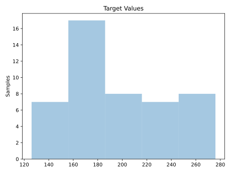
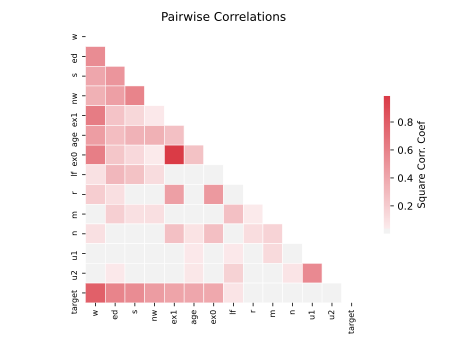

# 1089_USCrime

[Metadata](metadata.yaml) | [Summary Statistics](summary_stats.csv)

## Summary

- **task**: regression
- **number of instances**: 47
- **number of features**: 13

## Summary Plots

## Data Summary

|        |   count |       mean |        std |   min |    25% |   50% |    75% |    max |
|:-------|--------:|-----------:|-----------:|------:|-------:|------:|-------:|-------:|
| R      |      47 |  90.5085   |  38.6763   |  34.2 |  65.85 |  83.1 | 105.75 |  199.3 |
| Age    |      47 | 138.574    |  12.5676   | 119   | 130    | 136   | 146    |  177   |
| S      |      47 |   0.340426 |   0.478975 |   0   |   0    |   0   |   1    |    1   |
| Ed     |      47 | 105.638    |  11.187    |  87   |  97.5  | 108   | 114.5  |  122   |
| Ex0    |      47 |  85        |  29.719    |  45   |  62.5  |  78   | 104.5  |  166   |
| Ex1    |      47 |  80.234    |  27.9613   |  41   |  58.5  |  73   |  97    |  157   |
| LF     |      47 | 561.191    |  40.4118   | 480   | 530.5  | 560   | 593    |  641   |
| M      |      47 | 983.021    |  29.4674   | 934   | 964.5  | 977   | 992    | 1071   |
| N      |      47 |  36.617    |  38.0712   |   3   |  10    |  25   |  41.5  |  168   |
| NW     |      47 | 101.128    | 102.829    |   2   |  24    |  76   | 132.5  |  423   |
| U1     |      47 |  95.4681   |  18.0288   |  70   |  80.5  |  92   | 104    |  142   |
| U2     |      47 |  33.9787   |   8.44545  |  20   |  27.5  |  34   |  38.5  |   58   |
| W      |      47 | 525.383    |  96.4909   | 288   | 459.5  | 537   | 591.5  |  689   |
| target |      47 | 194        |  39.8961   | 126   | 165.5  | 176   | 227.5  |  276   |
