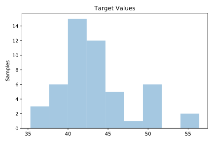
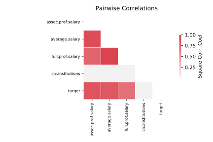

# 1096_FacultySalaries

[Metadata](metadata.yaml) | [Summary Statistics](summary_stats.csv)

## Summary

**task**: regression

**instances**: 50

**features**: 4

## Summary Plots

## Data Summary

|	variable	|	count	|	mean	|	std	|	min	|	25%	|	50%	|	75%	|	max|
| --- | --- | --- | --- | --- | --- | --- | --- | --- |
|	CIC.institutions	|	50	|	0	|	0	|	0	|	0	|	0	|	0	|	1
|	average.salary	|	50	|	58	|	6	|	45	|	53	|	56	|	63	|	75
|	full.prof.salary	|	50	|	73	|	10	|	55	|	66	|	72	|	79	|	96
|	assoc.prof.salary	|	50	|	51	|	5	|	41	|	47	|	50	|	54	|	70
|	target	|	50	|	43	|	4	|	35	|	40	|	42	|	44	|	56
