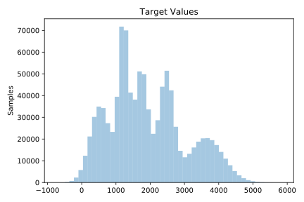
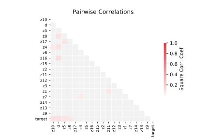

# 1191_BNG_pbc

[Metadata](metadata.yaml) | [Summary Statistics](summary_stats.csv)

## Summary

**task**: regression

**instances**: 1000000

**features**: 18

## Summary Plots

## Data Summary

|	variable	|	count	|	mean	|	std	|	min	|	25%	|	50%	|	75%	|	max|
| --- | --- | --- | --- | --- | --- | --- | --- | --- |
|	D	|	1000000	|	0	|	0	|	0	|	0	|	1	|	1	|	1
|	Z1	|	1000000	|	0	|	0	|	0	|	0	|	0	|	1	|	1
|	Z2	|	1000000	|	50	|	10	|	22	|	43	|	50	|	57	|	84
|	Z3	|	1000000	|	0	|	0	|	0	|	0	|	0	|	0	|	1
|	Z4	|	1000000	|	0	|	0	|	0	|	1	|	1	|	1	|	1
|	Z5	|	1000000	|	0	|	0	|	0	|	0	|	0	|	1	|	1
|	Z6	|	1000000	|	0	|	0	|	0	|	1	|	1	|	1	|	1
|	Z7	|	1000000	|	1	|	0	|	0	|	1	|	1	|	1	|	2
|	Z8	|	1000000	|	3	|	4	|	-14	|	0	|	1	|	3	|	35
|	Z9	|	1000000	|	372	|	201	|	-882	|	261	|	342	|	392	|	2065
|	Z10	|	1000000	|	3	|	0	|	1	|	3	|	3	|	3	|	4
|	Z11	|	1000000	|	86	|	78	|	-156	|	42	|	56	|	104	|	632
|	Z12	|	1000000	|	1833	|	2021	|	-7466	|	879	|	1095	|	1794	|	18792
|	Z13	|	1000000	|	118	|	54	|	1	|	81	|	105	|	143	|	433
|	Z14	|	1000000	|	122	|	61	|	-91	|	86	|	108	|	139	|	588
|	Z15	|	1000000	|	254	|	99	|	12	|	186	|	247	|	309	|	730
|	Z16	|	1000000	|	10	|	1	|	7	|	10	|	10	|	11	|	16
|	Z17	|	1000000	|	1	|	0	|	0	|	0	|	1	|	2	|	3
|	target	|	1000000	|	1917	|	1103	|	-756	|	1133	|	1745	|	2592	|	5856
