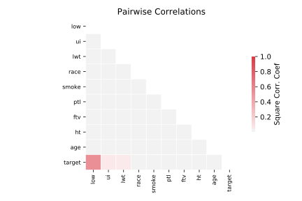

# 1193_BNG_lowbwt

[Metadata](metadata.yaml) | [Summary Statistics](summary_stats.csv)

## Summary

**task**: regression

**instances**: 31104

**features**: 9

## Summary Plots

## Data Summary

|	variable	|	count	|	mean	|	std	|	min	|	25%	|	50%	|	75%	|	max|
| --- | --- | --- | --- | --- | --- | --- | --- | --- |
|	LOW	|	31104	|	0	|	0	|	0	|	0	|	0	|	1	|	1
|	AGE	|	31104	|	23	|	5	|	11	|	19	|	22	|	25	|	42
|	LWT	|	31104	|	129	|	30	|	68	|	110	|	122	|	138	|	275
|	RACE	|	31104	|	1	|	0	|	0	|	1	|	1	|	2	|	2
|	SMOKE	|	31104	|	0	|	0	|	0	|	0	|	0	|	1	|	1
|	PTL	|	31104	|	0	|	0	|	0	|	0	|	0	|	0	|	3
|	HT	|	31104	|	0	|	0	|	0	|	0	|	0	|	0	|	1
|	UI	|	31104	|	0	|	0	|	0	|	1	|	1	|	1	|	1
|	FTV	|	31104	|	1	|	1	|	0	|	0	|	0	|	2	|	5
|	target	|	31104	|	2941	|	726	|	446	|	2465	|	2976	|	3457	|	4859
