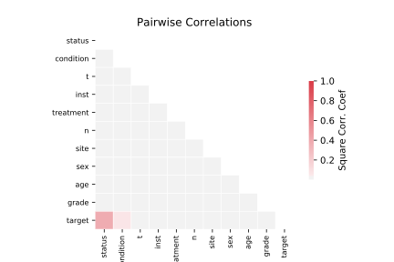

# 1196_BNG_pharynx

[Metadata](metadata.yaml) | [Summary Statistics](summary_stats.csv)

## Summary

**task**: regression

**instances**: 1000000

**features**: 10

## Summary Plots

## Data Summary

|	variable	|	count	|	mean	|	std	|	min	|	25%	|	50%	|	75%	|	max|
| --- | --- | --- | --- | --- | --- | --- | --- | --- |
|	Inst	|	1000000	|	2	|	1	|	0	|	1	|	2	|	4	|	5
|	sex	|	1000000	|	0	|	0	|	0	|	1	|	1	|	1	|	1
|	Treatment	|	1000000	|	0	|	0	|	0	|	0	|	0	|	1	|	1
|	Grade	|	1000000	|	0	|	0	|	0	|	0	|	1	|	1	|	2
|	Age	|	1000000	|	60	|	11	|	18	|	52	|	60	|	67	|	99
|	Condition	|	1000000	|	0	|	0	|	0	|	0	|	0	|	1	|	4
|	Site	|	1000000	|	1	|	0	|	0	|	0	|	1	|	2	|	2
|	T	|	1000000	|	0	|	1	|	0	|	0	|	1	|	2	|	3
|	N	|	1000000	|	1	|	0	|	0	|	1	|	1	|	2	|	3
|	Status	|	1000000	|	0	|	0	|	0	|	0	|	0	|	1	|	1
|	target	|	1000000	|	558	|	417	|	-110	|	247	|	438	|	758	|	2434
