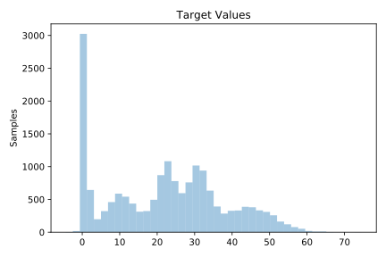
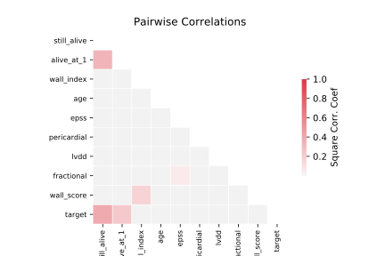

# 1199_BNG_echoMonths

[Metadata](metadata.yaml) | [Summary Statistics](summary_stats.csv)

## Summary

**task**: regression

**instances**: 17496

**features**: 9

## Summary Plots

## Data Summary

|	variable	|	count	|	mean	|	std	|	min	|	25%	|	50%	|	75%	|	max|
| --- | --- | --- | --- | --- | --- | --- | --- | --- |
|	still_alive	|	17496	|	0	|	0	|	0	|	0	|	0	|	1	|	1
|	age	|	17496	|	62	|	8	|	38	|	58	|	62	|	66	|	92
|	pericardial	|	17496	|	0	|	0	|	0	|	0	|	0	|	0	|	1
|	fractional	|	17496	|	0	|	0	|	0	|	0	|	0	|	0	|	0
|	epss	|	17496	|	11	|	7	|	-4	|	7	|	10	|	15	|	42
|	lvdd	|	17496	|	4	|	0	|	2	|	4	|	4	|	5	|	7
|	wall_score	|	17496	|	14	|	5	|	1	|	11	|	13	|	16	|	37
|	wall_index	|	17496	|	1	|	0	|	0	|	1	|	1	|	1	|	3
|	alive_at_1	|	17496	|	0	|	0	|	0	|	0	|	0	|	0	|	1
|	target	|	17496	|	21	|	15	|	-4	|	7	|	22	|	32	|	74
