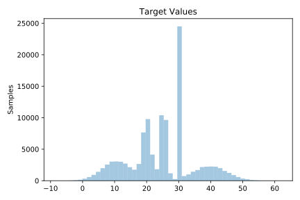
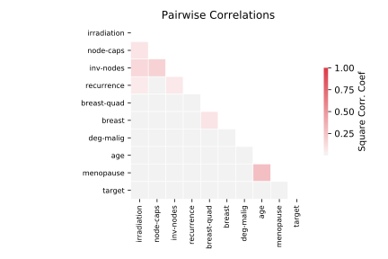

# 1201_BNG_breastTumor

[Metadata](metadata.yaml) | [Summary Statistics](summary_stats.csv)

## Summary

**task**: regression

**instances**: 116640

**features**: 9

## Summary Plots

## Data Summary

|	variable	|	count	|	mean	|	std	|	min	|	25%	|	50%	|	75%	|	max|
| --- | --- | --- | --- | --- | --- | --- | --- | --- |
|	age	|	116640	|	50	|	9	|	22	|	44	|	50	|	57	|	75
|	menopause	|	116640	|	0	|	0	|	0	|	0	|	0	|	1	|	2
|	inv-nodes	|	116640	|	3	|	4	|	0	|	0	|	1	|	4	|	17
|	node-caps	|	116640	|	0	|	0	|	0	|	0	|	0	|	0	|	1
|	deg-malig	|	116640	|	1	|	0	|	0	|	1	|	1	|	2	|	2
|	breast	|	116640	|	0	|	0	|	0	|	0	|	1	|	1	|	1
|	breast-quad	|	116640	|	1	|	1	|	0	|	0	|	2	|	2	|	4
|	irradiation	|	116640	|	0	|	0	|	0	|	0	|	0	|	1	|	1
|	recurrence	|	116640	|	0	|	0	|	0	|	0	|	0	|	1	|	1
|	target	|	116640	|	24	|	10	|	-8	|	18	|	25	|	30	|	62
