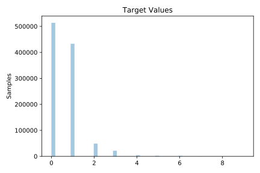
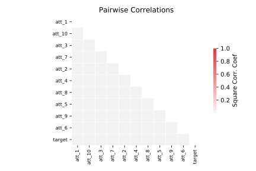

# 1595_poker

[Metadata](metadata.yaml) | [Summary Statistics](summary_stats.csv)

## Summary

**task**: regression

**instances**: 1025010

**features**: 10

## Summary Plots

## Data Summary

|	variable	|	count	|	mean	|	std	|	min	|	25%	|	50%	|	75%	|	max|
| --- | --- | --- | --- | --- | --- | --- | --- | --- |
|	att_1	|	1025010	|	2	|	1	|	1	|	2	|	3	|	3	|	4
|	att_2	|	1025010	|	6	|	3	|	1	|	4	|	7	|	10	|	13
|	att_3	|	1025010	|	2	|	1	|	1	|	1	|	2	|	4	|	4
|	att_4	|	1025010	|	7	|	3	|	1	|	4	|	7	|	10	|	13
|	att_5	|	1025010	|	2	|	1	|	1	|	1	|	3	|	4	|	4
|	att_6	|	1025010	|	6	|	3	|	1	|	4	|	7	|	10	|	13
|	att_7	|	1025010	|	2	|	1	|	1	|	2	|	3	|	3	|	4
|	att_8	|	1025010	|	7	|	3	|	1	|	4	|	7	|	10	|	13
|	att_9	|	1025010	|	2	|	1	|	1	|	1	|	2	|	4	|	4
|	att_10	|	1025010	|	6	|	3	|	1	|	4	|	7	|	10	|	13
|	target	|	1025010	|	0	|	0	|	0	|	0	|	0	|	1	|	9
