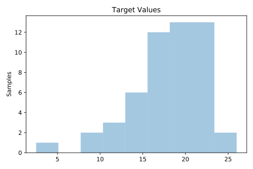
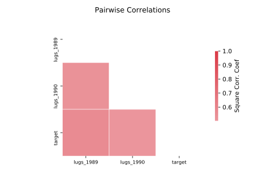

# 192_vineyard

[Metadata](metadata.yaml) | [Summary Statistics](summary_stats.csv)

## Summary

**task**: regression

**instances**: 52

**features**: 2

## Summary Plots

## Data Summary

|	variable	|	count	|	mean	|	std	|	min	|	25%	|	50%	|	75%	|	max|
| --- | --- | --- | --- | --- | --- | --- | --- | --- |
|	lugs_1989	|	52	|	3	|	1	|	0	|	2	|	3	|	5	|	8
|	lugs_1990	|	52	|	9	|	2	|	2	|	8	|	10	|	11	|	14
|	target	|	52	|	18	|	4	|	2	|	16	|	19	|	21	|	26
