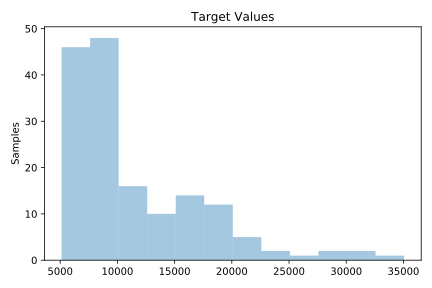
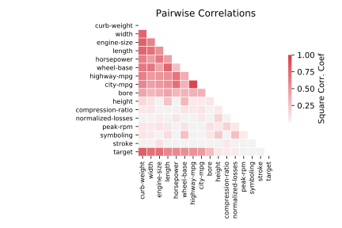

# 195_auto_price

[Metadata](metadata.yaml) | [Summary Statistics](summary_stats.csv)

## Summary

**task**: regression

**instances**: 159

**features**: 15

## Summary Plots

## Data Summary

|	variable	|	count	|	mean	|	std	|	min	|	25%	|	50%	|	75%	|	max|
| --- | --- | --- | --- | --- | --- | --- | --- | --- |
|	symboling	|	159	|	3	|	1	|	1	|	3	|	4	|	5	|	6
|	normalized-losses	|	159	|	121	|	35	|	65	|	94	|	113	|	148	|	256
|	wheel-base	|	159	|	98	|	5	|	86	|	94	|	96	|	100	|	115
|	length	|	159	|	172	|	11	|	141	|	165	|	172	|	177	|	202
|	width	|	159	|	65	|	1	|	60	|	64	|	65	|	66	|	71
|	height	|	159	|	53	|	2	|	49	|	52	|	54	|	55	|	59
|	curb-weight	|	159	|	2461	|	481	|	1488	|	2065	|	2340	|	2809	|	4066
|	engine-size	|	159	|	119	|	30	|	61	|	97	|	110	|	135	|	258
|	bore	|	159	|	3	|	0	|	2	|	3	|	3	|	3	|	3
|	stroke	|	159	|	3	|	0	|	2	|	3	|	3	|	3	|	4
|	compression-ratio	|	159	|	10	|	3	|	7	|	8	|	9	|	9	|	23
|	horsepower	|	159	|	95	|	30	|	48	|	69	|	88	|	114	|	200
|	peak-rpm	|	159	|	5113	|	465	|	4150	|	4800	|	5200	|	5500	|	6600
|	city-mpg	|	159	|	26	|	6	|	15	|	23	|	26	|	31	|	49
|	highway-mpg	|	159	|	32	|	6	|	18	|	28	|	32	|	37	|	54
|	target	|	159	|	11445	|	5877	|	5118	|	7372	|	9233	|	14719	|	35056
