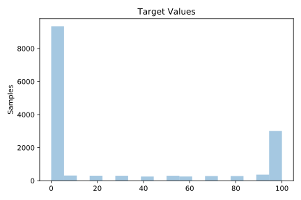
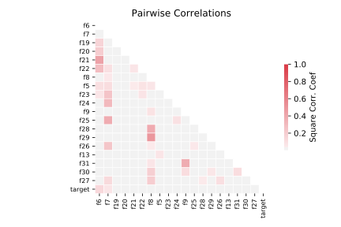

# 201_pol

[Metadata](metadata.yaml) | [Summary Statistics](summary_stats.csv)

## Summary

**task**: regression

**instances**: 15000

**features**: 48

## Summary Plots

## Data Summary

|	variable	|	count	|	mean	|	std	|	min	|	25%	|	50%	|	75%	|	max|
| --- | --- | --- | --- | --- | --- | --- | --- | --- |
|	f1	|	15000	|	110	|	0	|	110	|	110	|	110	|	110	|	110
|	f2	|	15000	|	100	|	0	|	100	|	100	|	100	|	100	|	100
|	f3	|	15000	|	100	|	0	|	100	|	100	|	100	|	100	|	100
|	f4	|	15000	|	100	|	0	|	100	|	100	|	100	|	100	|	100
|	f5	|	15000	|	76	|	35	|	13	|	56	|	74	|	100	|	200
|	f6	|	15000	|	94	|	20	|	77	|	77	|	86	|	106	|	200
|	f7	|	15000	|	83	|	16	|	76	|	76	|	76	|	81	|	200
|	f8	|	15000	|	75	|	13	|	71	|	71	|	71	|	72	|	200
|	f9	|	15000	|	95	|	8	|	94	|	94	|	94	|	94	|	200
|	f10	|	15000	|	0	|	0	|	0	|	0	|	0	|	0	|	0
|	f11	|	15000	|	0	|	0	|	0	|	0	|	0	|	0	|	0
|	f12	|	15000	|	0	|	0	|	0	|	0	|	0	|	0	|	0
|	f13	|	15000	|	5	|	14	|	0	|	0	|	0	|	2	|	134
|	f14	|	15000	|	12	|	19	|	0	|	0	|	1	|	19	|	134
|	f15	|	15000	|	12	|	19	|	0	|	0	|	1	|	19	|	150
|	f16	|	15000	|	12	|	19	|	0	|	0	|	1	|	19	|	133
|	f17	|	15000	|	11	|	19	|	0	|	0	|	1	|	19	|	131
|	f18	|	15000	|	11	|	19	|	0	|	0	|	0	|	19	|	143
|	f19	|	15000	|	8	|	16	|	0	|	0	|	0	|	5	|	117
|	f20	|	15000	|	3	|	11	|	0	|	0	|	0	|	0	|	117
|	f21	|	15000	|	3	|	11	|	0	|	0	|	0	|	0	|	116
|	f22	|	15000	|	3	|	11	|	0	|	0	|	0	|	0	|	131
|	f23	|	15000	|	2	|	9	|	0	|	0	|	0	|	0	|	104
|	f24	|	15000	|	1	|	6	|	0	|	0	|	0	|	0	|	90
|	f25	|	15000	|	1	|	6	|	0	|	0	|	0	|	0	|	72
|	f26	|	15000	|	0	|	5	|	0	|	0	|	0	|	0	|	108
|	f27	|	15000	|	0	|	5	|	0	|	0	|	0	|	0	|	96
|	f28	|	15000	|	1	|	5	|	0	|	0	|	0	|	0	|	74
|	f29	|	15000	|	0	|	4	|	0	|	0	|	0	|	0	|	67
|	f30	|	15000	|	0	|	3	|	0	|	0	|	0	|	0	|	44
|	f31	|	15000	|	0	|	3	|	0	|	0	|	0	|	0	|	69
|	f32	|	15000	|	0	|	3	|	0	|	0	|	0	|	0	|	50
|	f33	|	15000	|	0	|	2	|	0	|	0	|	0	|	0	|	39
|	f34	|	15000	|	0	|	0	|	0	|	0	|	0	|	0	|	0
|	f35	|	15000	|	0	|	0	|	0	|	0	|	0	|	0	|	0
|	f36	|	15000	|	0	|	0	|	0	|	0	|	0	|	0	|	0
|	f37	|	15000	|	0	|	0	|	0	|	0	|	0	|	0	|	0
|	f38	|	15000	|	0	|	0	|	0	|	0	|	0	|	0	|	0
|	f39	|	15000	|	0	|	0	|	0	|	0	|	0	|	0	|	0
|	f40	|	15000	|	0	|	0	|	0	|	0	|	0	|	0	|	0
|	f41	|	15000	|	0	|	0	|	0	|	0	|	0	|	0	|	0
|	f42	|	15000	|	0	|	0	|	0	|	0	|	0	|	0	|	0
|	f43	|	15000	|	0	|	0	|	0	|	0	|	0	|	0	|	0
|	f44	|	15000	|	0	|	0	|	0	|	0	|	0	|	0	|	0
|	f45	|	15000	|	0	|	0	|	0	|	0	|	0	|	0	|	0
|	f46	|	15000	|	0	|	0	|	0	|	0	|	0	|	0	|	0
|	f47	|	15000	|	0	|	0	|	0	|	0	|	0	|	0	|	0
|	f48	|	15000	|	0	|	0	|	0	|	0	|	0	|	0	|	0
|	target	|	15000	|	28	|	41	|	0	|	0	|	0	|	70	|	100
