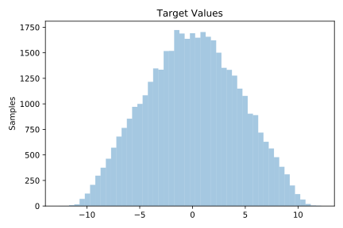
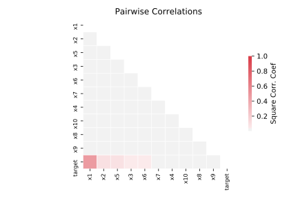

# 215_2dplanes

[Metadata](metadata.yaml) | [Summary Statistics](summary_stats.csv)

## Summary

**task**: regression

**instances**: 40768

**features**: 10

## Summary Plots

## Data Summary

|	variable	|	count	|	mean	|	std	|	min	|	25%	|	50%	|	75%	|	max|
| --- | --- | --- | --- | --- | --- | --- | --- | --- |
|	x1	|	40768	|	0	|	0	|	-1	|	-1	|	1	|	1	|	1
|	x2	|	40768	|	0	|	0	|	-1	|	-1	|	0	|	1	|	1
|	x3	|	40768	|	0	|	0	|	-1	|	-1	|	0	|	1	|	1
|	x4	|	40768	|	0	|	0	|	-1	|	-1	|	0	|	1	|	1
|	x5	|	40768	|	0	|	0	|	-1	|	-1	|	0	|	1	|	1
|	x6	|	40768	|	0	|	0	|	-1	|	-1	|	0	|	1	|	1
|	x7	|	40768	|	0	|	0	|	-1	|	-1	|	0	|	1	|	1
|	x8	|	40768	|	0	|	0	|	-1	|	-1	|	0	|	1	|	1
|	x9	|	40768	|	0	|	0	|	-1	|	-1	|	0	|	1	|	1
|	x10	|	40768	|	0	|	0	|	-1	|	-1	|	0	|	1	|	1
|	target	|	40768	|	0	|	4	|	-12	|	-3	|	0	|	3	|	12
