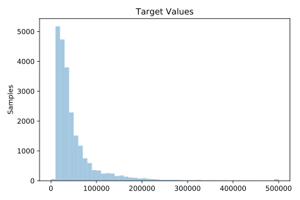
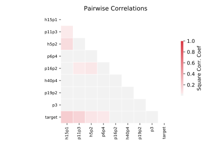

# 218_house_8L

[Metadata](metadata.yaml) | [Summary Statistics](summary_stats.csv)

## Summary

**task**: regression

**instances**: 22784

**features**: 8

## Summary Plots

## Data Summary

|	variable	|	count	|	mean	|	std	|	min	|	25%	|	50%	|	75%	|	max|
| --- | --- | --- | --- | --- | --- | --- | --- | --- |
|	P3	|	22784	|	2935	|	24949	|	1	|	163	|	506	|	1683	|	2819401
|	P6p4	|	22784	|	0	|	0	|	0	|	0	|	0	|	0	|	0
|	P11p3	|	22784	|	0	|	0	|	0	|	0	|	0	|	0	|	1
|	P16p2	|	22784	|	0	|	0	|	0	|	0	|	0	|	0	|	1
|	P19p2	|	22784	|	0	|	0	|	0	|	0	|	0	|	0	|	1
|	H5p2	|	22784	|	0	|	0	|	0	|	0	|	0	|	0	|	1
|	H15p1	|	22784	|	5	|	0	|	0	|	5	|	5	|	6	|	10
|	H40p4	|	22784	|	0	|	0	|	0	|	0	|	0	|	0	|	1
|	target	|	22784	|	50074	|	52843	|	0	|	21000	|	33200	|	56100	|	500001
