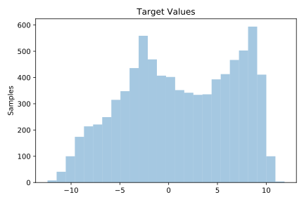

# 225_puma8NH

[Metadata](metadata.yaml) | [Summary Statistics](summary_stats.csv)

## Summary

**task**: regression

**instances**: 8192

**features**: 8

## Summary Plots

## Data Summary

|	variable	|	count	|	mean	|	std	|	min	|	25%	|	50%	|	75%	|	max|
| --- | --- | --- | --- | --- | --- | --- | --- | --- |
|	theta1	|	8192	|	0	|	1	|	-1	|	0	|	0	|	0	|	1
|	theta2	|	8192	|	0	|	1	|	-1	|	0	|	0	|	0	|	1
|	theta3	|	8192	|	0	|	1	|	-1	|	0	|	0	|	0	|	1
|	thetad1	|	8192	|	0	|	1	|	-1	|	0	|	0	|	0	|	1
|	thetad2	|	8192	|	0	|	1	|	-1	|	0	|	0	|	0	|	1
|	thetad3	|	8192	|	0	|	1	|	-1	|	0	|	0	|	0	|	1
|	tau1	|	8192	|	0	|	0	|	0	|	0	|	0	|	0	|	0
|	tau2	|	8192	|	0	|	0	|	0	|	0	|	0	|	0	|	0
|	target	|	8192	|	1	|	5	|	-12	|	-3	|	1	|	6	|	11
