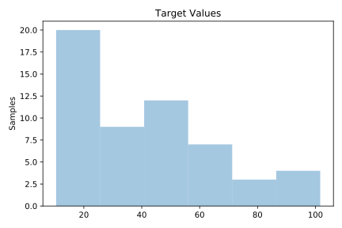
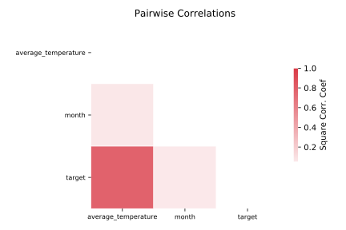

# 228_elusage

[Metadata](metadata.yaml) | [Summary Statistics](summary_stats.csv)

## Summary

**task**: regression

**instances**: 55

**features**: 2

## Summary Plots

## Data Summary

|	variable	|	count	|	mean	|	std	|	min	|	25%	|	50%	|	75%	|	max|
| --- | --- | --- | --- | --- | --- | --- | --- | --- |
|	average_temperature	|	55	|	53	|	15	|	24	|	40	|	54	|	68	|	79
|	month	|	55	|	5	|	3	|	0	|	2	|	6	|	9	|	11
|	target	|	55	|	43	|	24	|	10	|	24	|	38	|	57	|	101
