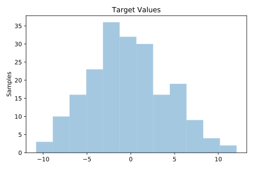
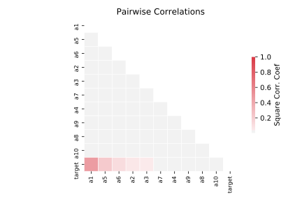

# 229_pwLinear

[Metadata](metadata.yaml) | [Summary Statistics](summary_stats.csv)

## Summary

**task**: regression

**instances**: 200

**features**: 10

## Summary Plots

## Data Summary

|	variable	|	count	|	mean	|	std	|	min	|	25%	|	50%	|	75%	|	max|
| --- | --- | --- | --- | --- | --- | --- | --- | --- |
|	a1	|	200	|	0	|	1	|	-1	|	-1	|	1	|	1	|	1
|	a2	|	200	|	0	|	0	|	-1	|	-1	|	0	|	1	|	1
|	a3	|	200	|	0	|	0	|	-1	|	-1	|	0	|	1	|	1
|	a4	|	200	|	0	|	0	|	-1	|	-1	|	0	|	1	|	1
|	a5	|	200	|	0	|	0	|	-1	|	-1	|	0	|	1	|	1
|	a6	|	200	|	0	|	0	|	-1	|	-1	|	0	|	1	|	1
|	a7	|	200	|	0	|	0	|	-1	|	-1	|	0	|	1	|	1
|	a8	|	200	|	0	|	0	|	-1	|	-1	|	0	|	1	|	1
|	a9	|	200	|	0	|	0	|	-1	|	-1	|	0	|	1	|	1
|	a10	|	200	|	0	|	0	|	-1	|	-1	|	0	|	1	|	1
|	target	|	200	|	0	|	4	|	-10	|	-3	|	0	|	2	|	12
