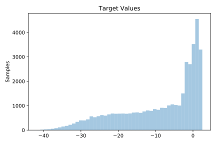
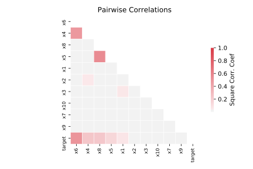

# 344_mv

[Metadata](metadata.yaml) | [Summary Statistics](summary_stats.csv)

## Summary

**task**: regression

**instances**: 40768

**features**: 10

## Summary Plots

## Data Summary

|	variable	|	count	|	mean	|	std	|	min	|	25%	|	50%	|	75%	|	max|
| --- | --- | --- | --- | --- | --- | --- | --- | --- |
|	x1	|	40768	|	0	|	2	|	-4	|	-2	|	0	|	2	|	4
|	x2	|	40768	|	-12	|	1	|	-14	|	-13	|	-12	|	-11	|	-10
|	x3	|	40768	|	0	|	0	|	0	|	0	|	0	|	1	|	2
|	x4	|	40768	|	-4	|	3	|	-7	|	-6	|	-5	|	-1	|	2
|	x5	|	40768	|	0	|	0	|	0	|	0	|	0	|	0	|	0
|	x6	|	40768	|	-11	|	10	|	-37	|	-20	|	-9	|	-1	|	12
|	x7	|	40768	|	0	|	0	|	0	|	0	|	0	|	1	|	1
|	x8	|	40768	|	0	|	0	|	0	|	0	|	0	|	0	|	1
|	x9	|	40768	|	299	|	115	|	100	|	199	|	299	|	398	|	500
|	x10	|	40768	|	1100	|	58	|	1000	|	1050	|	1101	|	1150	|	1200
|	target	|	40768	|	-8	|	10	|	-41	|	-16	|	-5	|	0	|	2
