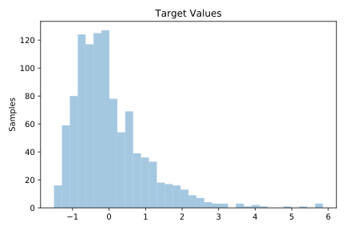
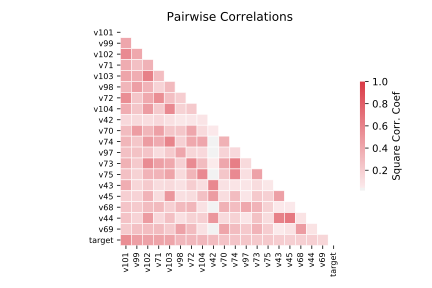

# 4544_GeographicalOriginalofMusic

[Metadata](metadata.yaml) | [Summary Statistics](summary_stats.csv)

## Summary

**task**: regression

**instances**: 1059

**features**: 117

## Summary Plots

## Data Summary

|	variable	|	count	|	mean	|	std	|	min	|	25%	|	50%	|	75%	|	max|
| --- | --- | --- | --- | --- | --- | --- | --- | --- |
|	V1	|	1059	|	0	|	0	|	-1	|	0	|	0	|	0	|	9
|	V2	|	1059	|	0	|	0	|	-1	|	0	|	0	|	0	|	10
|	V3	|	1059	|	0	|	0	|	-1	|	0	|	0	|	0	|	6
|	V4	|	1059	|	0	|	0	|	-3	|	0	|	0	|	0	|	5
|	V5	|	1059	|	0	|	0	|	-3	|	0	|	0	|	0	|	2
|	V6	|	1059	|	0	|	1	|	-4	|	0	|	0	|	0	|	2
|	V7	|	1059	|	0	|	0	|	-4	|	0	|	0	|	0	|	2
|	V8	|	1059	|	0	|	1	|	-5	|	0	|	0	|	0	|	3
|	V9	|	1059	|	0	|	1	|	-5	|	0	|	0	|	0	|	3
|	V10	|	1059	|	0	|	1	|	-6	|	0	|	0	|	0	|	3
|	V11	|	1059	|	0	|	1	|	-5	|	0	|	0	|	0	|	5
|	V12	|	1059	|	0	|	1	|	-5	|	0	|	0	|	0	|	4
|	V13	|	1059	|	0	|	1	|	-4	|	0	|	0	|	0	|	3
|	V14	|	1059	|	0	|	1	|	-5	|	0	|	0	|	0	|	7
|	V15	|	1059	|	0	|	1	|	-4	|	0	|	0	|	0	|	6
|	V16	|	1059	|	0	|	1	|	-4	|	0	|	0	|	0	|	5
|	V17	|	1059	|	0	|	1	|	-5	|	0	|	0	|	0	|	4
|	V18	|	1059	|	0	|	1	|	0	|	0	|	0	|	0	|	8
|	V19	|	1059	|	0	|	1	|	0	|	0	|	0	|	0	|	8
|	V20	|	1059	|	0	|	1	|	0	|	0	|	0	|	0	|	8
|	V21	|	1059	|	0	|	1	|	0	|	0	|	0	|	0	|	8
|	V22	|	1059	|	0	|	1	|	0	|	0	|	0	|	0	|	8
|	V23	|	1059	|	0	|	1	|	0	|	0	|	0	|	0	|	8
|	V24	|	1059	|	0	|	1	|	0	|	0	|	0	|	0	|	8
|	V25	|	1059	|	0	|	1	|	0	|	0	|	0	|	0	|	8
|	V26	|	1059	|	0	|	1	|	0	|	0	|	0	|	0	|	8
|	V27	|	1059	|	0	|	1	|	0	|	0	|	0	|	0	|	8
|	V28	|	1059	|	0	|	1	|	0	|	0	|	0	|	0	|	8
|	V29	|	1059	|	0	|	1	|	0	|	0	|	0	|	0	|	8
|	V30	|	1059	|	0	|	0	|	-1	|	0	|	0	|	0	|	9
|	V31	|	1059	|	0	|	0	|	-1	|	0	|	0	|	0	|	9
|	V32	|	1059	|	0	|	0	|	-1	|	0	|	0	|	0	|	3
|	V33	|	1059	|	0	|	0	|	-1	|	0	|	0	|	0	|	7
|	V34	|	1059	|	0	|	0	|	-2	|	0	|	0	|	0	|	4
|	V35	|	1059	|	0	|	0	|	-2	|	0	|	0	|	0	|	5
|	V36	|	1059	|	0	|	0	|	-2	|	0	|	0	|	0	|	6
|	V37	|	1059	|	0	|	0	|	-3	|	0	|	0	|	0	|	4
|	V38	|	1059	|	0	|	1	|	-3	|	0	|	0	|	0	|	4
|	V39	|	1059	|	0	|	1	|	-2	|	0	|	0	|	0	|	6
|	V40	|	1059	|	0	|	1	|	-3	|	0	|	0	|	0	|	6
|	V41	|	1059	|	0	|	1	|	-3	|	0	|	0	|	0	|	7
|	V42	|	1059	|	0	|	1	|	-3	|	0	|	0	|	0	|	5
|	V43	|	1059	|	0	|	1	|	-2	|	0	|	0	|	0	|	4
|	V44	|	1059	|	0	|	0	|	-2	|	0	|	0	|	0	|	4
|	V45	|	1059	|	0	|	1	|	-2	|	0	|	0	|	0	|	5
|	V46	|	1059	|	0	|	1	|	-2	|	0	|	0	|	0	|	5
|	V47	|	1059	|	0	|	1	|	0	|	0	|	0	|	0	|	9
|	V48	|	1059	|	0	|	1	|	0	|	0	|	0	|	0	|	9
|	V49	|	1059	|	0	|	1	|	0	|	0	|	0	|	0	|	9
|	V50	|	1059	|	0	|	1	|	0	|	0	|	0	|	0	|	9
|	V51	|	1059	|	0	|	1	|	0	|	0	|	0	|	0	|	9
|	V52	|	1059	|	0	|	1	|	0	|	0	|	0	|	0	|	9
|	V53	|	1059	|	0	|	1	|	0	|	0	|	0	|	0	|	9
|	V54	|	1059	|	0	|	1	|	0	|	0	|	0	|	0	|	9
|	V55	|	1059	|	0	|	1	|	0	|	0	|	0	|	0	|	9
|	V56	|	1059	|	0	|	1	|	0	|	0	|	0	|	0	|	9
|	V57	|	1059	|	0	|	1	|	0	|	0	|	0	|	0	|	9
|	V58	|	1059	|	0	|	1	|	0	|	0	|	0	|	0	|	9
|	V59	|	1059	|	0	|	0	|	0	|	0	|	0	|	0	|	6
|	V60	|	1059	|	0	|	0	|	-1	|	0	|	0	|	0	|	4
|	V61	|	1059	|	0	|	0	|	-1	|	0	|	0	|	0	|	4
|	V62	|	1059	|	0	|	1	|	-1	|	0	|	0	|	0	|	7
|	V63	|	1059	|	0	|	1	|	-1	|	0	|	0	|	0	|	4
|	V64	|	1059	|	0	|	0	|	-1	|	0	|	0	|	0	|	7
|	V65	|	1059	|	0	|	0	|	-1	|	0	|	0	|	0	|	5
|	V66	|	1059	|	0	|	1	|	-1	|	0	|	0	|	0	|	5
|	V67	|	1059	|	0	|	1	|	-1	|	0	|	0	|	0	|	5
|	V68	|	1059	|	0	|	1	|	-1	|	0	|	0	|	0	|	7
|	V69	|	1059	|	0	|	1	|	-1	|	0	|	0	|	0	|	6
|	V70	|	1059	|	0	|	1	|	-1	|	0	|	0	|	0	|	5
|	V71	|	1059	|	0	|	1	|	-1	|	0	|	0	|	0	|	8
|	V72	|	1059	|	0	|	1	|	-1	|	0	|	0	|	0	|	8
|	V73	|	1059	|	0	|	1	|	-1	|	0	|	0	|	0	|	5
|	V74	|	1059	|	0	|	1	|	-1	|	0	|	0	|	0	|	7
|	V75	|	1059	|	0	|	1	|	-1	|	0	|	0	|	0	|	6
|	V76	|	1059	|	0	|	1	|	0	|	0	|	0	|	0	|	8
|	V77	|	1059	|	0	|	1	|	0	|	0	|	0	|	0	|	8
|	V78	|	1059	|	0	|	1	|	0	|	0	|	0	|	0	|	8
|	V79	|	1059	|	0	|	1	|	0	|	0	|	0	|	0	|	8
|	V80	|	1059	|	0	|	1	|	0	|	0	|	0	|	0	|	8
|	V81	|	1059	|	0	|	1	|	0	|	0	|	0	|	0	|	8
|	V82	|	1059	|	0	|	1	|	0	|	0	|	0	|	0	|	8
|	V83	|	1059	|	0	|	1	|	0	|	0	|	0	|	0	|	8
|	V84	|	1059	|	0	|	1	|	0	|	0	|	0	|	0	|	8
|	V85	|	1059	|	0	|	1	|	0	|	0	|	0	|	0	|	8
|	V86	|	1059	|	0	|	1	|	0	|	0	|	0	|	0	|	8
|	V87	|	1059	|	0	|	1	|	0	|	0	|	0	|	0	|	8
|	V88	|	1059	|	0	|	0	|	-1	|	0	|	0	|	0	|	5
|	V89	|	1059	|	0	|	0	|	-1	|	0	|	0	|	0	|	4
|	V90	|	1059	|	0	|	0	|	-2	|	0	|	0	|	0	|	2
|	V91	|	1059	|	0	|	0	|	-2	|	0	|	0	|	0	|	12
|	V92	|	1059	|	0	|	1	|	-2	|	0	|	0	|	0	|	4
|	V93	|	1059	|	0	|	0	|	-2	|	0	|	0	|	0	|	4
|	V94	|	1059	|	0	|	0	|	-1	|	0	|	0	|	0	|	4
|	V95	|	1059	|	0	|	1	|	-1	|	0	|	0	|	0	|	5
|	V96	|	1059	|	0	|	1	|	-1	|	0	|	0	|	0	|	4
|	V97	|	1059	|	0	|	1	|	-1	|	0	|	0	|	0	|	7
|	V98	|	1059	|	0	|	1	|	-1	|	0	|	0	|	0	|	5
|	V99	|	1059	|	0	|	1	|	-1	|	0	|	0	|	0	|	8
|	V101	|	1059	|	0	|	1	|	-1	|	0	|	0	|	0	|	5
|	V102	|	1059	|	0	|	1	|	-1	|	0	|	0	|	0	|	6
|	V103	|	1059	|	0	|	1	|	-1	|	0	|	0	|	0	|	5
|	V104	|	1059	|	0	|	1	|	-1	|	0	|	0	|	0	|	5
|	V105	|	1059	|	0	|	1	|	0	|	0	|	0	|	0	|	8
|	V106	|	1059	|	0	|	1	|	0	|	0	|	0	|	0	|	8
|	V107	|	1059	|	0	|	1	|	0	|	0	|	0	|	0	|	8
|	V108	|	1059	|	0	|	1	|	0	|	0	|	0	|	0	|	8
|	V109	|	1059	|	0	|	1	|	0	|	0	|	0	|	0	|	8
|	V110	|	1059	|	0	|	1	|	0	|	0	|	0	|	0	|	8
|	V111	|	1059	|	0	|	1	|	0	|	0	|	0	|	0	|	8
|	V112	|	1059	|	0	|	1	|	0	|	0	|	0	|	0	|	8
|	V113	|	1059	|	0	|	1	|	0	|	0	|	0	|	0	|	8
|	V114	|	1059	|	0	|	1	|	0	|	0	|	0	|	0	|	8
|	V115	|	1059	|	0	|	1	|	0	|	0	|	0	|	0	|	8
|	V116	|	1059	|	0	|	1	|	0	|	0	|	0	|	0	|	8
|	V117	|	1059	|	26	|	18	|	-35	|	14	|	33	|	39	|	54
|	V118	|	1059	|	38	|	50	|	-88	|	3	|	32	|	74	|	149
|	target	|	1059	|	0	|	1	|	-1	|	0	|	0	|	0	|	5
