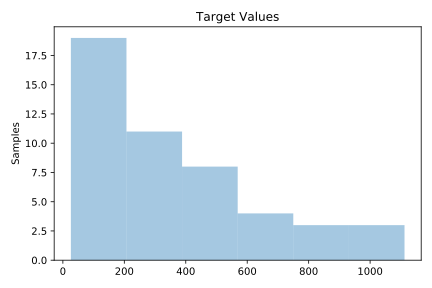
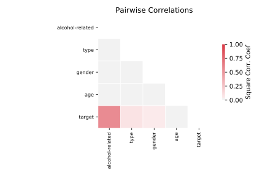

# 485_analcatdata_vehicle

[Metadata](metadata.yaml) | [Summary Statistics](summary_stats.csv)

## Summary

**task**: regression

**instances**: 48

**features**: 4

## Summary Plots

## Data Summary

|	variable	|	count	|	mean	|	std	|	min	|	25%	|	50%	|	75%	|	max|
| --- | --- | --- | --- | --- | --- | --- | --- | --- |
|	Alcohol-related	|	48	|	0	|	0	|	0	|	0	|	0	|	1	|	1
|	Gender	|	48	|	0	|	0	|	0	|	0	|	0	|	1	|	1
|	Type	|	48	|	0	|	0	|	0	|	0	|	0	|	1	|	1
|	Age	|	48	|	2	|	1	|	0	|	1	|	2	|	4	|	5
|	target	|	48	|	347	|	284	|	26	|	120	|	259	|	490	|	1112
