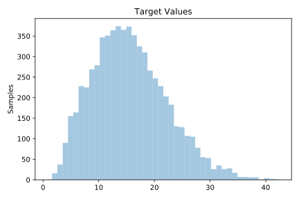
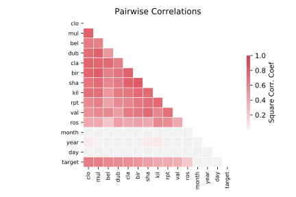

# 503_wind

[Metadata](metadata.yaml) | [Summary Statistics](summary_stats.csv)

## Summary

**task**: regression

**instances**: 6574

**features**: 14

## Summary Plots

## Data Summary

|	variable	|	count	|	mean	|	std	|	min	|	25%	|	50%	|	75%	|	max|
| --- | --- | --- | --- | --- | --- | --- | --- | --- |
|	year	|	6574	|	69	|	5	|	61	|	65	|	69	|	74	|	78
|	month	|	6574	|	6	|	3	|	1	|	4	|	7	|	10	|	12
|	day	|	6574	|	15	|	8	|	1	|	8	|	16	|	23	|	31
|	RPT	|	6574	|	12	|	5	|	0	|	8	|	11	|	15	|	35
|	VAL	|	6574	|	10	|	5	|	0	|	6	|	10	|	14	|	33
|	ROS	|	6574	|	11	|	5	|	1	|	8	|	10	|	14	|	33
|	KIL	|	6574	|	6	|	3	|	0	|	3	|	5	|	8	|	28
|	SHA	|	6574	|	10	|	4	|	0	|	6	|	9	|	13	|	37
|	BIR	|	6574	|	7	|	3	|	0	|	4	|	6	|	9	|	26
|	DUB	|	6574	|	9	|	4	|	0	|	6	|	9	|	12	|	30
|	CLA	|	6574	|	8	|	4	|	0	|	5	|	8	|	11	|	31
|	MUL	|	6574	|	8	|	4	|	0	|	5	|	8	|	11	|	25
|	CLO	|	6574	|	8	|	4	|	0	|	5	|	8	|	11	|	28
|	BEL	|	6574	|	13	|	5	|	0	|	8	|	12	|	16	|	42
|	target	|	6574	|	15	|	6	|	0	|	10	|	15	|	19	|	42
