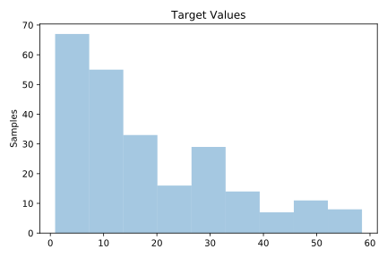
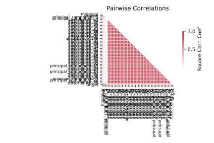

# 505_tecator

[Metadata](metadata.yaml) | [Summary Statistics](summary_stats.csv)

## Summary

**task**: regression

**instances**: 240

**features**: 124

## Summary Plots

## Data Summary

|	variable	|	count	|	mean	|	std	|	min	|	25%	|	50%	|	75%	|	max|
| --- | --- | --- | --- | --- | --- | --- | --- | --- |
|	absorbance_1	|	240	|	2	|	0	|	2	|	2	|	2	|	3	|	4
|	absorbance_2	|	240	|	2	|	0	|	2	|	2	|	2	|	3	|	4
|	absorbance_3	|	240	|	2	|	0	|	2	|	2	|	2	|	3	|	4
|	absorbance_4	|	240	|	2	|	0	|	2	|	2	|	2	|	3	|	4
|	absorbance_5	|	240	|	2	|	0	|	2	|	2	|	2	|	3	|	4
|	absorbance_6	|	240	|	2	|	0	|	2	|	2	|	2	|	3	|	4
|	absorbance_7	|	240	|	2	|	0	|	2	|	2	|	2	|	3	|	4
|	absorbance_8	|	240	|	2	|	0	|	2	|	2	|	2	|	3	|	4
|	absorbance_9	|	240	|	2	|	0	|	2	|	2	|	2	|	3	|	4
|	absorbance_10	|	240	|	2	|	0	|	2	|	2	|	2	|	3	|	4
|	absorbance_11	|	240	|	2	|	0	|	2	|	2	|	2	|	3	|	4
|	absorbance_12	|	240	|	2	|	0	|	2	|	2	|	2	|	3	|	4
|	absorbance_13	|	240	|	2	|	0	|	2	|	2	|	2	|	3	|	4
|	absorbance_14	|	240	|	2	|	0	|	2	|	2	|	2	|	3	|	4
|	absorbance_15	|	240	|	2	|	0	|	2	|	2	|	2	|	3	|	4
|	absorbance_16	|	240	|	2	|	0	|	2	|	2	|	2	|	3	|	4
|	absorbance_17	|	240	|	2	|	0	|	2	|	2	|	2	|	3	|	4
|	absorbance_18	|	240	|	2	|	0	|	2	|	2	|	2	|	3	|	4
|	absorbance_19	|	240	|	2	|	0	|	2	|	2	|	2	|	3	|	4
|	absorbance_20	|	240	|	2	|	0	|	2	|	2	|	2	|	3	|	4
|	absorbance_21	|	240	|	2	|	0	|	2	|	2	|	2	|	3	|	4
|	absorbance_22	|	240	|	2	|	0	|	2	|	2	|	2	|	3	|	4
|	absorbance_23	|	240	|	2	|	0	|	2	|	2	|	2	|	3	|	4
|	absorbance_24	|	240	|	2	|	0	|	2	|	2	|	2	|	3	|	4
|	absorbance_25	|	240	|	2	|	0	|	2	|	2	|	2	|	3	|	4
|	absorbance_26	|	240	|	2	|	0	|	2	|	2	|	2	|	3	|	4
|	absorbance_27	|	240	|	2	|	0	|	2	|	2	|	2	|	3	|	4
|	absorbance_28	|	240	|	2	|	0	|	2	|	2	|	2	|	3	|	4
|	absorbance_29	|	240	|	2	|	0	|	2	|	2	|	2	|	3	|	4
|	absorbance_30	|	240	|	2	|	0	|	2	|	2	|	2	|	3	|	4
|	absorbance_31	|	240	|	3	|	0	|	2	|	2	|	2	|	3	|	4
|	absorbance_32	|	240	|	3	|	0	|	2	|	2	|	2	|	3	|	4
|	absorbance_33	|	240	|	3	|	0	|	2	|	2	|	2	|	3	|	4
|	absorbance_34	|	240	|	3	|	0	|	2	|	2	|	2	|	3	|	4
|	absorbance_35	|	240	|	3	|	0	|	2	|	2	|	2	|	3	|	4
|	absorbance_36	|	240	|	3	|	0	|	2	|	2	|	2	|	3	|	5
|	absorbance_37	|	240	|	3	|	0	|	2	|	2	|	2	|	3	|	5
|	absorbance_38	|	240	|	3	|	0	|	2	|	2	|	2	|	3	|	5
|	absorbance_39	|	240	|	3	|	0	|	2	|	2	|	3	|	3	|	5
|	absorbance_40	|	240	|	3	|	0	|	2	|	2	|	3	|	3	|	5
|	absorbance_41	|	240	|	3	|	0	|	2	|	2	|	3	|	3	|	5
|	absorbance_42	|	240	|	3	|	0	|	2	|	2	|	3	|	3	|	5
|	absorbance_43	|	240	|	3	|	0	|	2	|	2	|	3	|	3	|	5
|	absorbance_44	|	240	|	3	|	0	|	2	|	2	|	3	|	3	|	5
|	absorbance_45	|	240	|	3	|	0	|	2	|	2	|	3	|	3	|	5
|	absorbance_46	|	240	|	3	|	0	|	2	|	2	|	3	|	3	|	5
|	absorbance_47	|	240	|	3	|	0	|	2	|	2	|	3	|	3	|	5
|	absorbance_48	|	240	|	3	|	0	|	2	|	2	|	3	|	3	|	5
|	absorbance_49	|	240	|	3	|	0	|	2	|	2	|	3	|	3	|	5
|	absorbance_50	|	240	|	3	|	0	|	2	|	2	|	3	|	3	|	5
|	absorbance_51	|	240	|	3	|	0	|	2	|	2	|	3	|	3	|	5
|	absorbance_52	|	240	|	3	|	0	|	2	|	3	|	3	|	3	|	5
|	absorbance_53	|	240	|	3	|	0	|	2	|	3	|	3	|	3	|	5
|	absorbance_54	|	240	|	3	|	0	|	2	|	3	|	3	|	3	|	5
|	absorbance_55	|	240	|	3	|	0	|	2	|	3	|	3	|	3	|	5
|	absorbance_56	|	240	|	3	|	0	|	2	|	3	|	3	|	3	|	5
|	absorbance_57	|	240	|	3	|	0	|	2	|	3	|	3	|	3	|	5
|	absorbance_58	|	240	|	3	|	0	|	2	|	3	|	3	|	3	|	5
|	absorbance_59	|	240	|	3	|	0	|	2	|	3	|	3	|	3	|	5
|	absorbance_60	|	240	|	3	|	0	|	2	|	3	|	3	|	3	|	5
|	absorbance_61	|	240	|	3	|	0	|	2	|	3	|	3	|	3	|	5
|	absorbance_62	|	240	|	3	|	0	|	2	|	3	|	3	|	3	|	5
|	absorbance_63	|	240	|	3	|	0	|	2	|	3	|	3	|	3	|	5
|	absorbance_64	|	240	|	3	|	0	|	2	|	3	|	3	|	3	|	5
|	absorbance_65	|	240	|	3	|	0	|	2	|	3	|	3	|	3	|	5
|	absorbance_66	|	240	|	3	|	0	|	2	|	3	|	3	|	3	|	5
|	absorbance_67	|	240	|	3	|	0	|	2	|	3	|	3	|	3	|	5
|	absorbance_68	|	240	|	3	|	0	|	2	|	3	|	3	|	3	|	5
|	absorbance_69	|	240	|	3	|	0	|	2	|	3	|	3	|	3	|	5
|	absorbance_70	|	240	|	3	|	0	|	2	|	3	|	3	|	3	|	5
|	absorbance_71	|	240	|	3	|	0	|	2	|	3	|	3	|	3	|	5
|	absorbance_72	|	240	|	3	|	0	|	2	|	3	|	3	|	3	|	5
|	absorbance_73	|	240	|	3	|	0	|	2	|	3	|	3	|	3	|	5
|	absorbance_74	|	240	|	3	|	0	|	2	|	3	|	3	|	3	|	5
|	absorbance_75	|	240	|	3	|	0	|	2	|	3	|	3	|	3	|	5
|	absorbance_76	|	240	|	3	|	0	|	2	|	3	|	3	|	3	|	5
|	absorbance_77	|	240	|	3	|	0	|	2	|	3	|	3	|	3	|	5
|	absorbance_78	|	240	|	3	|	0	|	2	|	3	|	3	|	3	|	5
|	absorbance_79	|	240	|	3	|	0	|	2	|	3	|	3	|	3	|	5
|	absorbance_80	|	240	|	3	|	0	|	2	|	3	|	3	|	3	|	5
|	absorbance_81	|	240	|	3	|	0	|	2	|	3	|	3	|	3	|	5
|	absorbance_82	|	240	|	3	|	0	|	2	|	2	|	3	|	3	|	5
|	absorbance_83	|	240	|	3	|	0	|	2	|	2	|	3	|	3	|	5
|	absorbance_84	|	240	|	3	|	0	|	2	|	2	|	3	|	3	|	5
|	absorbance_85	|	240	|	3	|	0	|	2	|	2	|	3	|	3	|	5
|	absorbance_86	|	240	|	3	|	0	|	2	|	2	|	3	|	3	|	5
|	absorbance_87	|	240	|	3	|	0	|	2	|	2	|	3	|	3	|	5
|	absorbance_88	|	240	|	3	|	0	|	2	|	2	|	3	|	3	|	5
|	absorbance_89	|	240	|	3	|	0	|	2	|	2	|	3	|	3	|	5
|	absorbance_90	|	240	|	3	|	0	|	2	|	2	|	3	|	3	|	5
|	absorbance_91	|	240	|	3	|	0	|	2	|	2	|	3	|	3	|	5
|	absorbance_92	|	240	|	3	|	0	|	2	|	2	|	3	|	3	|	5
|	absorbance_93	|	240	|	3	|	0	|	2	|	2	|	3	|	3	|	5
|	absorbance_94	|	240	|	3	|	0	|	2	|	2	|	3	|	3	|	5
|	absorbance_95	|	240	|	3	|	0	|	2	|	2	|	3	|	3	|	5
|	absorbance_96	|	240	|	3	|	0	|	2	|	2	|	3	|	3	|	5
|	absorbance_97	|	240	|	3	|	0	|	2	|	2	|	3	|	3	|	5
|	absorbance_98	|	240	|	3	|	0	|	2	|	2	|	2	|	3	|	5
|	absorbance_99	|	240	|	3	|	0	|	2	|	2	|	2	|	3	|	4
|	absorbance_100	|	240	|	3	|	0	|	2	|	2	|	2	|	3	|	4
|	principal_component_1	|	240	|	0	|	1	|	-1	|	0	|	0	|	0	|	3
|	principal_component_2	|	240	|	0	|	0	|	-4	|	0	|	0	|	0	|	2
|	principal_component_3	|	240	|	0	|	1	|	-3	|	0	|	0	|	0	|	3
|	principal_component_4	|	240	|	0	|	1	|	-4	|	0	|	0	|	0	|	2
|	principal_component_5	|	240	|	0	|	1	|	-2	|	0	|	0	|	0	|	3
|	principal_component_6	|	240	|	0	|	0	|	-2	|	0	|	0	|	0	|	3
|	principal_component_7	|	240	|	0	|	0	|	-3	|	0	|	0	|	0	|	3
|	principal_component_8	|	240	|	0	|	1	|	-2	|	0	|	0	|	0	|	5
|	principal_component_9	|	240	|	0	|	0	|	-1	|	0	|	0	|	0	|	3
|	principal_component_10	|	240	|	0	|	0	|	-2	|	0	|	0	|	0	|	4
|	principal_component_11	|	240	|	0	|	1	|	-2	|	0	|	0	|	0	|	4
|	principal_component_12	|	240	|	0	|	1	|	-3	|	0	|	0	|	0	|	7
|	principal_component_13	|	240	|	0	|	1	|	-3	|	0	|	0	|	0	|	8
|	principal_component_14	|	240	|	0	|	0	|	-4	|	0	|	0	|	0	|	1
|	principal_component_15	|	240	|	0	|	1	|	-5	|	0	|	0	|	0	|	1
|	principal_component_16	|	240	|	0	|	1	|	-4	|	0	|	0	|	0	|	1
|	principal_component_17	|	240	|	0	|	1	|	-4	|	0	|	0	|	0	|	3
|	principal_component_18	|	240	|	0	|	1	|	-5	|	0	|	0	|	0	|	3
|	principal_component_19	|	240	|	0	|	1	|	-5	|	0	|	0	|	0	|	1
|	principal_component_20	|	240	|	0	|	1	|	-1	|	0	|	0	|	0	|	3
|	principal_component_21	|	240	|	0	|	0	|	-1	|	0	|	0	|	0	|	4
|	principal_component_22	|	240	|	0	|	1	|	-1	|	0	|	0	|	0	|	3
|	moisture	|	240	|	62	|	11	|	32	|	55	|	66	|	72	|	76
|	protein	|	240	|	17	|	3	|	8	|	15	|	19	|	20	|	23
|	target	|	240	|	18	|	14	|	0	|	7	|	13	|	28	|	58
