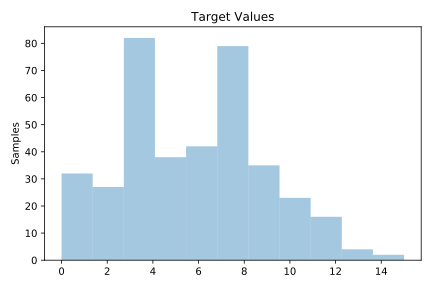
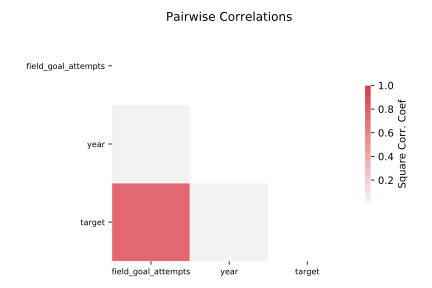

# 519_vinnie

[Metadata](metadata.yaml) | [Summary Statistics](summary_stats.csv)

## Summary

**task**: regression

**instances**: 380

**features**: 2

## Summary Plots

## Data Summary

|	variable	|	count	|	mean	|	std	|	min	|	25%	|	50%	|	75%	|	max|
| --- | --- | --- | --- | --- | --- | --- | --- | --- |
|	year	|	380	|	86	|	1	|	85	|	86	|	87	|	88	|	88
|	field_goal_attempts	|	380	|	12	|	4	|	1	|	10	|	13	|	16	|	25
|	target	|	380	|	5	|	3	|	0	|	3	|	6	|	8	|	15
