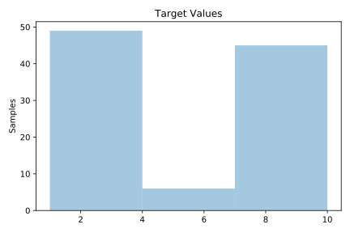
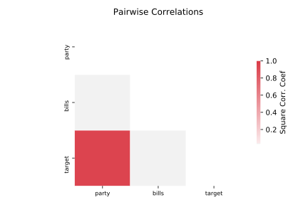

# 523_analcatdata_neavote

[Metadata](metadata.yaml) | [Summary Statistics](summary_stats.csv)

## Summary

**task**: regression

**instances**: 100

**features**: 2

## Summary Plots

## Data Summary

|	variable	|	count	|	mean	|	std	|	min	|	25%	|	50%	|	75%	|	max|
| --- | --- | --- | --- | --- | --- | --- | --- | --- |
|	Party	|	100	|	1	|	0	|	0	|	0	|	2	|	2	|	2
|	Bills	|	100	|	9	|	0	|	8	|	10	|	10	|	10	|	10
|	target	|	100	|	5	|	3	|	1	|	2	|	4	|	10	|	10
