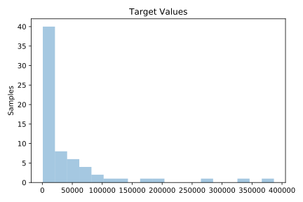

# 527_analcatdata_election2000

[Metadata](metadata.yaml) | [Summary Statistics](summary_stats.csv)

## Summary

**task**: regression

**instances**: 67

**features**: 14

## Summary Plots

## Data Summary

|	variable	|	count	|	mean	|	std	|	min	|	25%	|	50%	|	75%	|	max|
| --- | --- | --- | --- | --- | --- | --- | --- | --- |
|	Bush00	|	67	|	43355	|	56989	|	1316	|	4746	|	20196	|	56541	|	289456
|	Buchanan00	|	67	|	258	|	449	|	9	|	46	|	114	|	285	|	3407
|	Nader00	|	67	|	1441	|	2021	|	19	|	95	|	562	|	1871	|	9986
|	Browne00	|	67	|	280	|	476	|	4	|	23	|	116	|	321	|	3211
|	Hagelin00	|	67	|	34	|	66	|	0	|	3	|	13	|	33	|	444
|	Harris00	|	67	|	156	|	1207	|	0	|	1	|	4	|	8	|	9888
|	McReynolds00	|	67	|	19	|	87	|	0	|	1	|	3	|	5	|	658
|	Moorehead00	|	67	|	27	|	37	|	0	|	4	|	12	|	32	|	167
|	Phillips00	|	67	|	63	|	356	|	0	|	3	|	10	|	20	|	2927
|	Total00	|	67	|	88978	|	131680	|	2403	|	8079	|	34941	|	102873	|	625269
|	Clinton96	|	67	|	37939	|	66019	|	829	|	3136	|	13246	|	38956	|	320736
|	Dole96	|	67	|	33482	|	44743	|	913	|	3343	|	15608	|	41993	|	209634
|	Perot96	|	67	|	7220	|	8972	|	316	|	1072	|	3739	|	8700	|	38964
|	Total96	|	67	|	79129	|	117817	|	2164	|	7672	|	33699	|	90915	|	553491
|	target	|	67	|	43341	|	74833	|	788	|	3055	|	14152	|	45974	|	386518
