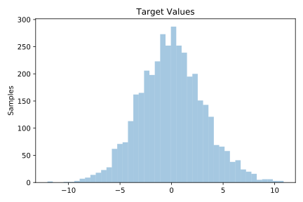
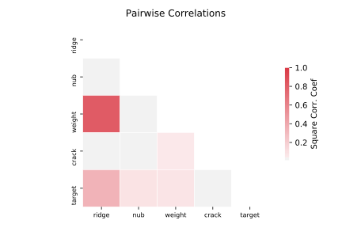

# 529_pollen

[Metadata](metadata.yaml) | [Summary Statistics](summary_stats.csv)

## Summary

**task**: regression

**instances**: 3848

**features**: 4

## Summary Plots

## Data Summary

|	variable	|	count	|	mean	|	std	|	min	|	25%	|	50%	|	75%	|	max|
| --- | --- | --- | --- | --- | --- | --- | --- | --- |
|	RIDGE	|	3848	|	0	|	6	|	-23	|	-3	|	0	|	4	|	21
|	NUB	|	3848	|	0	|	5	|	-16	|	-3	|	0	|	3	|	17
|	CRACK	|	3848	|	0	|	7	|	-31	|	-5	|	0	|	5	|	30
|	WEIGHT	|	3848	|	0	|	10	|	-34	|	-7	|	0	|	6	|	35
|	target	|	3848	|	0	|	3	|	-12	|	-2	|	0	|	2	|	10
