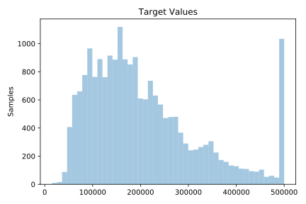
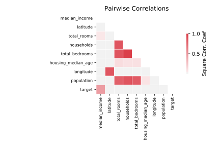

# 537_houses

[Metadata](metadata.yaml) | [Summary Statistics](summary_stats.csv)

## Summary

**task**: regression

**instances**: 20640

**features**: 8

## Summary Plots

## Data Summary

|	variable	|	count	|	mean	|	std	|	min	|	25%	|	50%	|	75%	|	max|
| --- | --- | --- | --- | --- | --- | --- | --- | --- |
|	median_income	|	20640	|	3	|	1	|	0	|	2	|	3	|	4	|	15
|	housing_median_age	|	20640	|	28	|	12	|	1	|	18	|	29	|	37	|	52
|	total_rooms	|	20640	|	2635	|	2181	|	2	|	1447	|	2127	|	3148	|	39320
|	total_bedrooms	|	20640	|	537	|	421	|	1	|	295	|	435	|	647	|	6445
|	population	|	20640	|	1425	|	1132	|	3	|	787	|	1166	|	1725	|	35682
|	households	|	20640	|	499	|	382	|	1	|	280	|	409	|	605	|	6082
|	latitude	|	20640	|	35	|	2	|	32	|	33	|	34	|	37	|	41
|	longitude	|	20640	|	-119	|	2	|	-124	|	-121	|	-118	|	-118	|	-114
|	target	|	20640	|	206855	|	115395	|	14999	|	119600	|	179700	|	264725	|	500001
