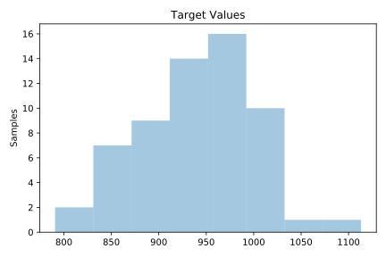
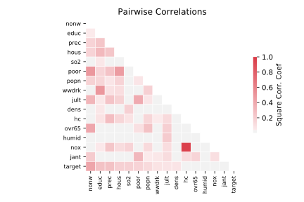

# 542_pollution

[Metadata](metadata.yaml) | [Summary Statistics](summary_stats.csv)

## Summary

**task**: regression

**instances**: 60

**features**: 15

## Summary Plots

## Data Summary

|	variable	|	count	|	mean	|	std	|	min	|	25%	|	50%	|	75%	|	max|
| --- | --- | --- | --- | --- | --- | --- | --- | --- |
|	PREC	|	60	|	37	|	9	|	10	|	32	|	38	|	43	|	60
|	JANT	|	60	|	33	|	10	|	12	|	27	|	31	|	40	|	67
|	JULT	|	60	|	74	|	4	|	63	|	72	|	74	|	77	|	85
|	OVR65	|	60	|	8	|	1	|	5	|	7	|	9	|	9	|	11
|	POPN	|	60	|	3	|	0	|	2	|	3	|	3	|	3	|	3
|	EDUC	|	60	|	10	|	0	|	9	|	10	|	11	|	11	|	12
|	HOUS	|	60	|	80	|	5	|	66	|	78	|	81	|	83	|	90
|	DENS	|	60	|	3876	|	1454	|	1441	|	3104	|	3567	|	4519	|	9699
|	NONW	|	60	|	11	|	8	|	0	|	4	|	10	|	15	|	38
|	WWDRK	|	60	|	46	|	4	|	33	|	43	|	45	|	49	|	59
|	POOR	|	60	|	14	|	4	|	9	|	12	|	13	|	15	|	26
|	HC	|	60	|	37	|	91	|	1	|	7	|	14	|	30	|	648
|	NOX	|	60	|	22	|	46	|	1	|	4	|	9	|	23	|	319
|	SO2	|	60	|	53	|	63	|	1	|	11	|	30	|	69	|	278
|	HUMID	|	60	|	57	|	5	|	38	|	55	|	57	|	60	|	73
|	target	|	60	|	940	|	62	|	790	|	898	|	943	|	983	|	1113
