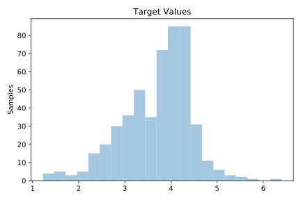

# 547_no2

[Metadata](metadata.yaml) | [Summary Statistics](summary_stats.csv)

## Summary

**task**: regression

**instances**: 500

**features**: 7

## Summary Plots

## Data Summary

|	variable	|	count	|	mean	|	std	|	min	|	25%	|	50%	|	75%	|	max|
| --- | --- | --- | --- | --- | --- | --- | --- | --- |
|	cars_per_hour	|	500	|	6	|	1	|	4	|	6	|	7	|	7	|	8
|	temperature_at_2m	|	500	|	0	|	6	|	-18	|	-3	|	1	|	4	|	21
|	wind_speed	|	500	|	3	|	1	|	0	|	1	|	2	|	4	|	9
|	temperature_diff_2m_25m	|	500	|	0	|	1	|	-5	|	0	|	0	|	0	|	4
|	wind_direction	|	500	|	143	|	86	|	2	|	72	|	97	|	220	|	359
|	hour_of_day	|	500	|	12	|	6	|	1	|	6	|	12	|	18	|	24
|	day	|	500	|	310	|	200	|	32	|	118	|	212	|	513	|	608
|	target	|	500	|	3	|	0	|	1	|	3	|	3	|	4	|	6
