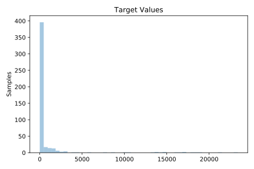
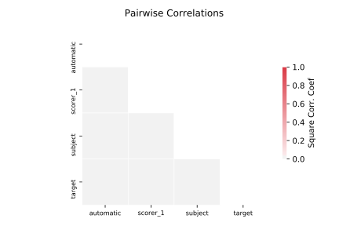

# 556_analcatdata_apnea2

[Metadata](metadata.yaml) | [Summary Statistics](summary_stats.csv)

## Summary

**task**: regression

**instances**: 475

**features**: 3

## Summary Plots

## Data Summary

|	variable	|	count	|	mean	|	std	|	min	|	25%	|	50%	|	75%	|	max|
| --- | --- | --- | --- | --- | --- | --- | --- | --- |
|	Automatic	|	475	|	2	|	1	|	0	|	1	|	2	|	3	|	4
|	Scorer_1	|	475	|	2	|	1	|	0	|	1	|	2	|	3	|	4
|	Subject	|	475	|	10	|	5	|	1	|	5	|	10	|	15	|	19
|	target	|	475	|	839	|	3114	|	0	|	0	|	0	|	113	|	23383
