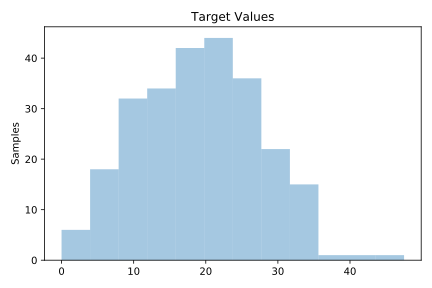
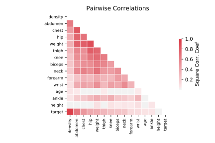

# 560_bodyfat

[Metadata](metadata.yaml) | [Summary Statistics](summary_stats.csv)

## Summary

**task**: regression

**instances**: 252

**features**: 14

## Summary Plots

## Data Summary

|	variable	|	count	|	mean	|	std	|	min	|	25%	|	50%	|	75%	|	max|
| --- | --- | --- | --- | --- | --- | --- | --- | --- |
|	Density	|	252	|	1	|	0	|	0	|	1	|	1	|	1	|	1
|	Age	|	252	|	44	|	12	|	22	|	35	|	43	|	54	|	81
|	Weight	|	252	|	178	|	29	|	118	|	159	|	176	|	197	|	363
|	Height	|	252	|	70	|	3	|	29	|	68	|	70	|	72	|	77
|	Neck	|	252	|	37	|	2	|	31	|	36	|	38	|	39	|	51
|	Chest	|	252	|	100	|	8	|	79	|	94	|	99	|	105	|	136
|	Abdomen	|	252	|	92	|	10	|	69	|	84	|	90	|	99	|	148
|	Hip	|	252	|	99	|	7	|	85	|	95	|	99	|	103	|	147
|	Thigh	|	252	|	59	|	5	|	47	|	56	|	59	|	62	|	87
|	Knee	|	252	|	38	|	2	|	33	|	36	|	38	|	39	|	49
|	Ankle	|	252	|	23	|	1	|	19	|	22	|	22	|	24	|	33
|	Biceps	|	252	|	32	|	3	|	24	|	30	|	32	|	34	|	45
|	Forearm	|	252	|	28	|	2	|	21	|	27	|	28	|	30	|	34
|	Wrist	|	252	|	18	|	0	|	15	|	17	|	18	|	18	|	21
|	target	|	252	|	19	|	8	|	0	|	12	|	19	|	25	|	47
