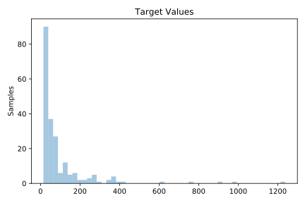
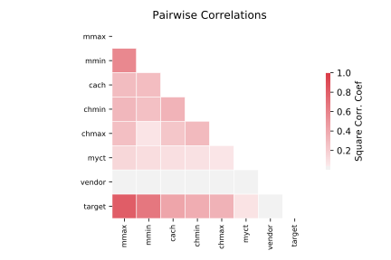

# 561_cpu

[Metadata](metadata.yaml) | [Summary Statistics](summary_stats.csv)

## Summary

**task**: regression

**instances**: 209

**features**: 7

## Summary Plots

## Data Summary

|	variable	|	count	|	mean	|	std	|	min	|	25%	|	50%	|	75%	|	max|
| --- | --- | --- | --- | --- | --- | --- | --- | --- |
|	vendor	|	209	|	15	|	7	|	0	|	10	|	17	|	21	|	29
|	MYCT	|	209	|	203	|	260	|	17	|	50	|	110	|	225	|	1500
|	MMIN	|	209	|	2867	|	3878	|	64	|	768	|	2000	|	4000	|	32000
|	MMAX	|	209	|	11796	|	11726	|	64	|	4000	|	8000	|	16000	|	64000
|	CACH	|	209	|	25	|	40	|	0	|	0	|	8	|	32	|	256
|	CHMIN	|	209	|	4	|	6	|	0	|	1	|	2	|	6	|	52
|	CHMAX	|	209	|	18	|	25	|	0	|	5	|	8	|	24	|	176
|	target	|	209	|	99	|	154	|	15	|	28	|	45	|	101	|	1238
