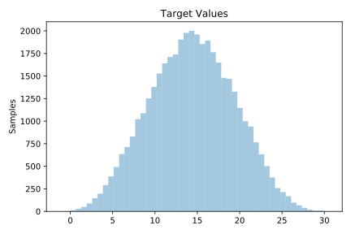
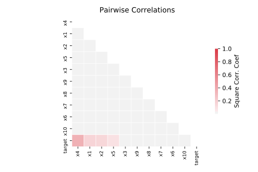

# 564_fried

[Metadata](metadata.yaml) | [Summary Statistics](summary_stats.csv)

## Summary

**task**: regression

**instances**: 40768

**features**: 10

## Summary Plots

## Data Summary

|	variable	|	count	|	mean	|	std	|	min	|	25%	|	50%	|	75%	|	max|
| --- | --- | --- | --- | --- | --- | --- | --- | --- |
|	X1	|	40768	|	0	|	0	|	0	|	0	|	0	|	0	|	1
|	X2	|	40768	|	0	|	0	|	0	|	0	|	0	|	0	|	1
|	X3	|	40768	|	0	|	0	|	0	|	0	|	0	|	0	|	1
|	X4	|	40768	|	0	|	0	|	0	|	0	|	0	|	0	|	1
|	X5	|	40768	|	0	|	0	|	0	|	0	|	0	|	0	|	1
|	X6	|	40768	|	0	|	0	|	0	|	0	|	0	|	0	|	1
|	X7	|	40768	|	0	|	0	|	0	|	0	|	0	|	0	|	1
|	X8	|	40768	|	0	|	0	|	0	|	0	|	0	|	0	|	1
|	X9	|	40768	|	0	|	0	|	0	|	0	|	0	|	0	|	1
|	X10	|	40768	|	0	|	0	|	0	|	0	|	0	|	0	|	1
|	target	|	40768	|	14	|	4	|	-1	|	10	|	14	|	17	|	30
