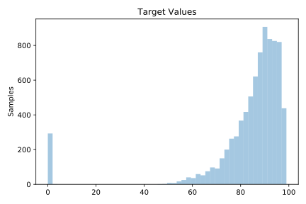
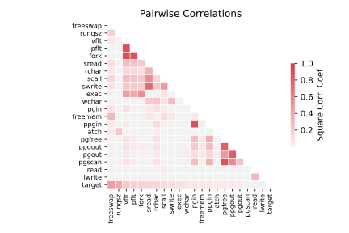

# 573_cpu_act

[Metadata](metadata.yaml) | [Summary Statistics](summary_stats.csv)

## Summary

**task**: regression

**instances**: 8192

**features**: 21

## Summary Plots

## Data Summary

|	variable	|	count	|	mean	|	std	|	min	|	25%	|	50%	|	75%	|	max|
| --- | --- | --- | --- | --- | --- | --- | --- | --- |
|	lread	|	8192	|	19	|	53	|	0	|	2	|	7	|	20	|	1845
|	lwrite	|	8192	|	13	|	29	|	0	|	0	|	1	|	10	|	575
|	scall	|	8192	|	2306	|	1633	|	109	|	1012	|	2051	|	3317	|	12493
|	sread	|	8192	|	210	|	198	|	6	|	86	|	166	|	279	|	5318
|	swrite	|	8192	|	150	|	160	|	7	|	63	|	117	|	185	|	5456
|	fork	|	8192	|	1	|	2	|	0	|	0	|	0	|	2	|	20
|	exec	|	8192	|	2	|	5	|	0	|	0	|	1	|	2	|	59
|	rchar	|	8192	|	197013	|	239480	|	278	|	33864	|	124779	|	267669	|	2526649
|	wchar	|	8192	|	95898	|	140756	|	1498	|	22935	|	46620	|	106148	|	1801623
|	pgout	|	8192	|	2	|	5	|	0	|	0	|	0	|	2	|	81
|	ppgout	|	8192	|	5	|	15	|	0	|	0	|	0	|	4	|	184
|	pgfree	|	8192	|	11	|	32	|	0	|	0	|	0	|	5	|	523
|	pgscan	|	8192	|	21	|	71	|	0	|	0	|	0	|	0	|	1237
|	atch	|	8192	|	1	|	5	|	0	|	0	|	0	|	0	|	211
|	pgin	|	8192	|	8	|	13	|	0	|	0	|	2	|	9	|	141
|	ppgin	|	8192	|	12	|	22	|	0	|	0	|	3	|	13	|	292
|	pflt	|	8192	|	109	|	114	|	0	|	25	|	63	|	159	|	899
|	vflt	|	8192	|	185	|	191	|	0	|	45	|	120	|	251	|	1365
|	runqsz	|	8192	|	19	|	125	|	1	|	1	|	2	|	3	|	2823
|	freemem	|	8192	|	1763	|	2482	|	55	|	231	|	579	|	2002	|	12027
|	freeswap	|	8192	|	1328125	|	422019	|	2	|	1042623	|	1289289	|	1730379	|	2243187
|	target	|	8192	|	83	|	18	|	0	|	81	|	89	|	94	|	99
