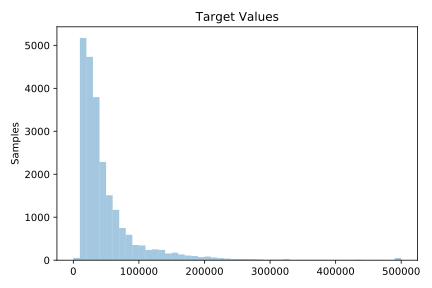
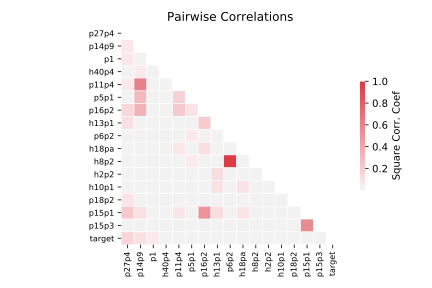

# 574_house_16H

[Metadata](metadata.yaml) | [Summary Statistics](summary_stats.csv)

## Summary

**task**: regression

**instances**: 22784

**features**: 16

## Summary Plots

## Data Summary

|	variable	|	count	|	mean	|	std	|	min	|	25%	|	50%	|	75%	|	max|
| --- | --- | --- | --- | --- | --- | --- | --- | --- |
|	P1	|	22784	|	7808	|	65872	|	2	|	427	|	1345	|	4518	|	7322564
|	P5p1	|	22784	|	0	|	0	|	0	|	0	|	0	|	0	|	0
|	P6p2	|	22784	|	0	|	0	|	0	|	0	|	0	|	0	|	1
|	P11p4	|	22784	|	0	|	0	|	0	|	0	|	0	|	0	|	0
|	P14p9	|	22784	|	0	|	0	|	0	|	0	|	0	|	0	|	0
|	P15p1	|	22784	|	0	|	0	|	0	|	0	|	0	|	0	|	1
|	P15p3	|	22784	|	0	|	0	|	0	|	0	|	0	|	0	|	0
|	P16p2	|	22784	|	0	|	0	|	0	|	0	|	0	|	0	|	1
|	P18p2	|	22784	|	0	|	0	|	0	|	0	|	0	|	0	|	0
|	P27p4	|	22784	|	0	|	0	|	0	|	0	|	0	|	0	|	0
|	H2p2	|	22784	|	0	|	0	|	0	|	0	|	0	|	0	|	0
|	H8p2	|	22784	|	0	|	0	|	0	|	0	|	0	|	0	|	1
|	H10p1	|	22784	|	0	|	0	|	0	|	0	|	0	|	1	|	1
|	H13p1	|	22784	|	0	|	0	|	0	|	0	|	0	|	0	|	1
|	H18pA	|	22784	|	0	|	0	|	0	|	0	|	0	|	0	|	1
|	H40p4	|	22784	|	0	|	0	|	0	|	0	|	0	|	0	|	1
|	target	|	22784	|	50074	|	52843	|	0	|	21000	|	33200	|	56100	|	500001
