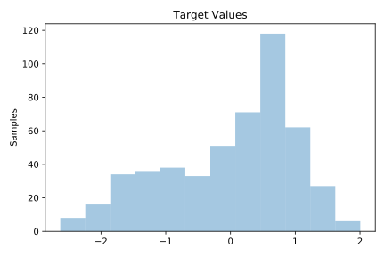
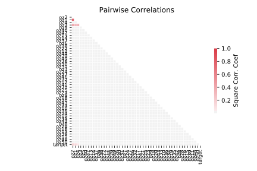

# 626_fri_c2_500_50

[Metadata](metadata.yaml) | [Summary Statistics](summary_stats.csv)

## Summary

**task**: regression

**instances**: 500

**features**: 50

## Summary Plots

## Data Summary

|	variable	|	count	|	mean	|	std	|	min	|	25%	|	50%	|	75%	|	max|
| --- | --- | --- | --- | --- | --- | --- | --- | --- |
|	oz1	|	500	|	0	|	1	|	-2	|	0	|	0	|	0	|	2
|	oz2	|	500	|	0	|	1	|	-1	|	0	|	0	|	0	|	1
|	oz3	|	500	|	0	|	1	|	-1	|	0	|	0	|	0	|	3
|	oz4	|	500	|	0	|	0	|	-1	|	0	|	0	|	0	|	1
|	oz5	|	500	|	0	|	0	|	-1	|	0	|	0	|	0	|	1
|	oz6	|	500	|	0	|	1	|	-1	|	0	|	0	|	0	|	1
|	oz7	|	500	|	0	|	0	|	-1	|	0	|	0	|	0	|	1
|	oz8	|	500	|	0	|	0	|	-1	|	0	|	0	|	0	|	1
|	oz9	|	500	|	0	|	0	|	-1	|	0	|	0	|	0	|	1
|	oz10	|	500	|	0	|	1	|	-1	|	0	|	0	|	0	|	1
|	oz11	|	500	|	0	|	0	|	-1	|	0	|	0	|	0	|	1
|	oz12	|	500	|	0	|	1	|	-1	|	0	|	0	|	0	|	1
|	oz13	|	500	|	0	|	1	|	-1	|	0	|	0	|	0	|	1
|	oz14	|	500	|	0	|	0	|	-1	|	0	|	0	|	0	|	1
|	oz15	|	500	|	0	|	1	|	-1	|	0	|	0	|	0	|	1
|	oz16	|	500	|	0	|	0	|	-1	|	0	|	0	|	0	|	1
|	oz17	|	500	|	0	|	0	|	-1	|	0	|	0	|	0	|	1
|	oz18	|	500	|	0	|	1	|	-1	|	0	|	0	|	0	|	1
|	oz19	|	500	|	0	|	1	|	-1	|	0	|	0	|	0	|	1
|	oz20	|	500	|	0	|	1	|	-1	|	0	|	0	|	0	|	1
|	oz21	|	500	|	0	|	1	|	-1	|	0	|	0	|	0	|	1
|	oz22	|	500	|	0	|	1	|	-1	|	0	|	0	|	0	|	1
|	oz23	|	500	|	0	|	0	|	-1	|	0	|	0	|	0	|	1
|	oz24	|	500	|	0	|	1	|	-1	|	0	|	0	|	0	|	1
|	oz25	|	500	|	0	|	0	|	-1	|	0	|	0	|	0	|	1
|	oz26	|	500	|	0	|	1	|	-1	|	0	|	0	|	0	|	1
|	oz27	|	500	|	0	|	1	|	-1	|	0	|	0	|	0	|	1
|	oz28	|	500	|	0	|	0	|	-1	|	0	|	0	|	0	|	1
|	oz29	|	500	|	0	|	0	|	-1	|	0	|	0	|	0	|	1
|	oz30	|	500	|	0	|	1	|	-1	|	0	|	0	|	0	|	1
|	oz31	|	500	|	0	|	1	|	-1	|	0	|	0	|	0	|	1
|	oz32	|	500	|	0	|	0	|	-1	|	0	|	0	|	0	|	1
|	oz33	|	500	|	0	|	1	|	-1	|	0	|	0	|	0	|	1
|	oz34	|	500	|	0	|	1	|	-1	|	0	|	0	|	0	|	1
|	oz35	|	500	|	0	|	1	|	-1	|	0	|	0	|	0	|	1
|	oz36	|	500	|	0	|	1	|	-1	|	0	|	0	|	0	|	1
|	oz37	|	500	|	0	|	1	|	-1	|	0	|	0	|	0	|	1
|	oz38	|	500	|	0	|	1	|	-1	|	0	|	0	|	0	|	1
|	oz39	|	500	|	0	|	0	|	-1	|	0	|	0	|	0	|	1
|	oz40	|	500	|	0	|	0	|	-1	|	0	|	0	|	0	|	1
|	oz41	|	500	|	0	|	0	|	-1	|	0	|	0	|	0	|	1
|	oz42	|	500	|	0	|	1	|	-1	|	0	|	0	|	0	|	1
|	oz43	|	500	|	0	|	0	|	-1	|	0	|	0	|	0	|	1
|	oz44	|	500	|	0	|	0	|	-1	|	0	|	0	|	0	|	1
|	oz45	|	500	|	0	|	0	|	-1	|	0	|	0	|	0	|	1
|	oz46	|	500	|	0	|	0	|	-1	|	0	|	0	|	0	|	1
|	oz47	|	500	|	0	|	0	|	-1	|	0	|	0	|	0	|	1
|	oz48	|	500	|	0	|	0	|	-1	|	0	|	0	|	0	|	1
|	oz49	|	500	|	0	|	0	|	-1	|	0	|	0	|	0	|	1
|	oz50	|	500	|	0	|	1	|	-1	|	0	|	0	|	0	|	1
|	target	|	500	|	0	|	1	|	-2	|	0	|	0	|	0	|	2
