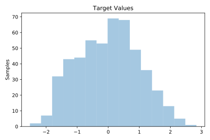
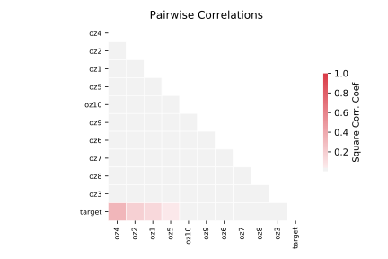

# 654_fri_c0_500_10

[Metadata](metadata.yaml) | [Summary Statistics](summary_stats.csv)

## Summary

**task**: regression

**instances**: 500

**features**: 10

## Summary Plots

## Data Summary

|	variable	|	count	|	mean	|	std	|	min	|	25%	|	50%	|	75%	|	max|
| --- | --- | --- | --- | --- | --- | --- | --- | --- |
|	oz1	|	500	|	0	|	0	|	-1	|	0	|	0	|	0	|	1
|	oz2	|	500	|	0	|	0	|	-1	|	0	|	0	|	0	|	1
|	oz3	|	500	|	0	|	1	|	-1	|	0	|	0	|	0	|	1
|	oz4	|	500	|	0	|	0	|	-1	|	0	|	0	|	0	|	1
|	oz5	|	500	|	0	|	1	|	-1	|	0	|	0	|	0	|	1
|	oz6	|	500	|	0	|	1	|	-1	|	0	|	0	|	0	|	1
|	oz7	|	500	|	0	|	0	|	-1	|	0	|	0	|	0	|	1
|	oz8	|	500	|	0	|	1	|	-1	|	0	|	0	|	0	|	1
|	oz9	|	500	|	0	|	1	|	-1	|	0	|	0	|	0	|	1
|	oz10	|	500	|	0	|	0	|	-1	|	0	|	0	|	0	|	1
|	target	|	500	|	0	|	1	|	-2	|	0	|	0	|	0	|	2
