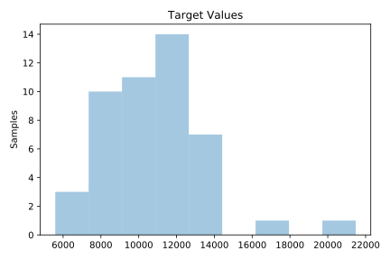
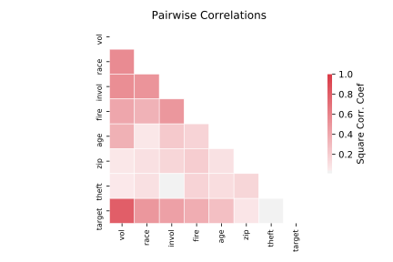

# 659_sleuth_ex1714

[Metadata](metadata.yaml) | [Summary Statistics](summary_stats.csv)

## Summary

**task**: regression

**instances**: 47

**features**: 7

## Summary Plots

## Data Summary

|	variable	|	count	|	mean	|	std	|	min	|	25%	|	50%	|	75%	|	max|
| --- | --- | --- | --- | --- | --- | --- | --- | --- |
|	zip	|	47	|	30	|	14	|	7	|	18	|	30	|	42	|	57
|	fire	|	47	|	12	|	9	|	2	|	5	|	10	|	16	|	39
|	theft	|	47	|	30	|	14	|	3	|	22	|	29	|	38	|	75
|	age	|	47	|	60	|	22	|	2	|	48	|	65	|	77	|	90
|	race	|	47	|	34	|	32	|	1	|	3	|	24	|	57	|	99
|	vol	|	47	|	6	|	4	|	0	|	3	|	5	|	10	|	17
|	invol	|	47	|	0	|	0	|	0	|	0	|	0	|	0	|	2
|	target	|	47	|	10695	|	2754	|	5583	|	8447	|	10694	|	11989	|	21480
