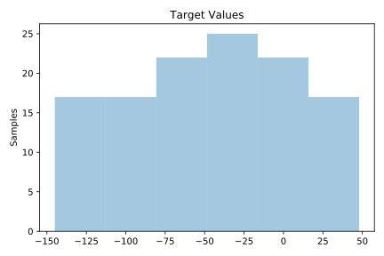
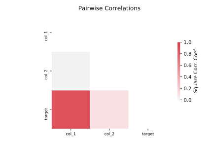

# 663_rabe_266

[Metadata](metadata.yaml) | [Summary Statistics](summary_stats.csv)

## Summary

**task**: regression

**instances**: 120

**features**: 2

## Summary Plots

## Data Summary

|	variable	|	count	|	mean	|	std	|	min	|	25%	|	50%	|	75%	|	max|
| --- | --- | --- | --- | --- | --- | --- | --- | --- |
|	col_1	|	120	|	-5	|	34	|	-60	|	-32	|	-5	|	22	|	50
|	col_2	|	120	|	27	|	14	|	5	|	15	|	27	|	40	|	50
|	target	|	120	|	-46	|	52	|	-145	|	-88	|	-42	|	-5	|	48
