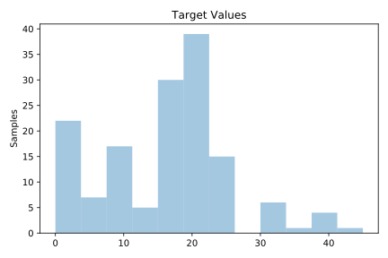
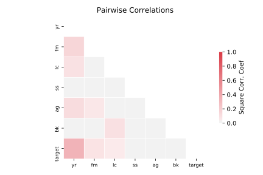

# 665_sleuth_case2002

[Metadata](metadata.yaml) | [Summary Statistics](summary_stats.csv)

## Summary

**task**: regression

**instances**: 147

**features**: 6

## Summary Plots

## Data Summary

|	variable	|	count	|	mean	|	std	|	min	|	25%	|	50%	|	75%	|	max|
| --- | --- | --- | --- | --- | --- | --- | --- | --- |
|	FM	|	147	|	0	|	0	|	0	|	0	|	0	|	0	|	1
|	LC	|	147	|	0	|	0	|	0	|	0	|	0	|	1	|	1
|	BK	|	147	|	0	|	0	|	0	|	0	|	0	|	1	|	1
|	SS	|	147	|	0	|	0	|	0	|	0	|	0	|	1	|	1
|	AG	|	147	|	56	|	7	|	37	|	52	|	59	|	63	|	67
|	YR	|	147	|	27	|	13	|	0	|	20	|	30	|	39	|	50
|	target	|	147	|	15	|	9	|	0	|	10	|	15	|	20	|	45
