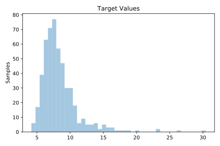
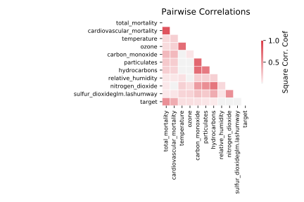

# 666_rmftsa_ladata

[Metadata](metadata.yaml) | [Summary Statistics](summary_stats.csv)

## Summary

**task**: regression

**instances**: 508

**features**: 10

## Summary Plots

## Data Summary

|	variable	|	count	|	mean	|	std	|	min	|	25%	|	50%	|	75%	|	max|
| --- | --- | --- | --- | --- | --- | --- | --- | --- |
|	Total_Mortality	|	508	|	169	|	14	|	142	|	159	|	166	|	176	|	231
|	Cardiovascular_Mortality	|	508	|	88	|	9	|	68	|	81	|	87	|	94	|	132
|	Temperature	|	508	|	74	|	9	|	50	|	67	|	74	|	81	|	99
|	Relative_Humidity	|	508	|	58	|	11	|	17	|	51	|	60	|	67	|	93
|	Carbon_Monoxide	|	508	|	7	|	3	|	2	|	4	|	6	|	10	|	22
|	Sulfur_Dioxideglm.LAshumway	|	508	|	2	|	1	|	0	|	2	|	2	|	3	|	6
|	Nitrogen_Dioxide	|	508	|	11	|	4	|	4	|	8	|	10	|	13	|	25
|	Hydrocarbons	|	508	|	50	|	13	|	21	|	40	|	48	|	59	|	100
|	Ozone	|	508	|	8	|	4	|	1	|	4	|	7	|	11	|	22
|	Particulates	|	508	|	47	|	15	|	20	|	35	|	44	|	57	|	97
|	target	|	508	|	8	|	2	|	4	|	6	|	7	|	9	|	30
