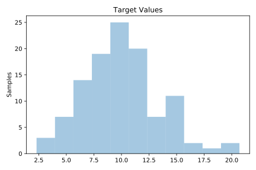
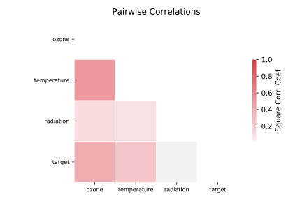

# 678_visualizing_environmental

[Metadata](metadata.yaml) | [Summary Statistics](summary_stats.csv)

## Summary

**task**: regression

**instances**: 111

**features**: 3

## Summary Plots

## Data Summary

|	variable	|	count	|	mean	|	std	|	min	|	25%	|	50%	|	75%	|	max|
| --- | --- | --- | --- | --- | --- | --- | --- | --- |
|	ozone	|	111	|	42	|	33	|	1	|	18	|	31	|	62	|	168
|	radiation	|	111	|	184	|	91	|	7	|	113	|	207	|	255	|	334
|	temperature	|	111	|	77	|	9	|	57	|	71	|	79	|	84	|	97
|	target	|	111	|	9	|	3	|	2	|	7	|	9	|	11	|	20
