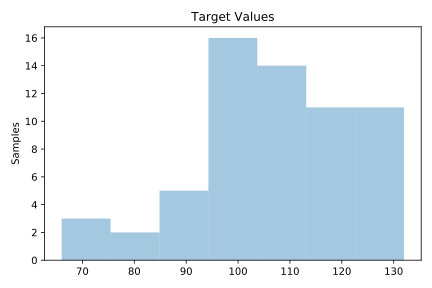
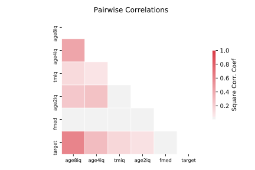

# 687_sleuth_ex1605

[Metadata](metadata.yaml) | [Summary Statistics](summary_stats.csv)

## Summary

**task**: regression

**instances**: 62

**features**: 5

## Summary Plots

## Data Summary

|	variable	|	count	|	mean	|	std	|	min	|	25%	|	50%	|	75%	|	max|
| --- | --- | --- | --- | --- | --- | --- | --- | --- |
|	FMED	|	62	|	12	|	2	|	4	|	10	|	13	|	14	|	19
|	TMIQ	|	62	|	85	|	15	|	53	|	74	|	88	|	96	|	128
|	Age2IQ	|	62	|	115	|	13	|	81	|	107	|	116	|	125	|	142
|	Age4IQ	|	62	|	112	|	13	|	87	|	105	|	112	|	120	|	145
|	Age8IQ	|	62	|	114	|	13	|	80	|	107	|	114	|	124	|	148
|	target	|	62	|	106	|	15	|	66	|	97	|	107	|	118	|	132
