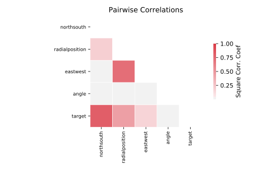

# 690_visualizing_galaxy

[Metadata](metadata.yaml) | [Summary Statistics](summary_stats.csv)

## Summary

**task**: regression

**instances**: 323

**features**: 4

## Summary Plots

## Data Summary

|	variable	|	count	|	mean	|	std	|	min	|	25%	|	50%	|	75%	|	max|
| --- | --- | --- | --- | --- | --- | --- | --- | --- |
|	eastwest	|	323	|	0	|	12	|	-29	|	-7	|	0	|	6	|	29
|	northsouth	|	323	|	1	|	22	|	-49	|	-13	|	0	|	18	|	49
|	angle	|	323	|	80	|	38	|	12	|	63	|	92	|	102	|	133
|	radialposition	|	323	|	0	|	25	|	-52	|	-21	|	0	|	19	|	55
|	target	|	323	|	1593	|	94	|	1409	|	1523	|	1586	|	1669	|	1775
