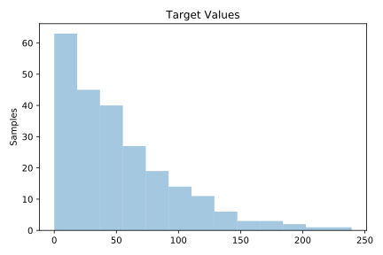
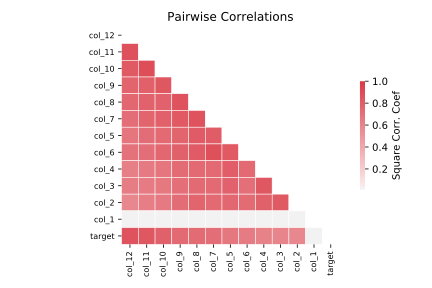

# 695_chatfield_4

[Metadata](metadata.yaml) | [Summary Statistics](summary_stats.csv)

## Summary

**task**: regression

**instances**: 235

**features**: 12

## Summary Plots

## Data Summary

|	variable	|	count	|	mean	|	std	|	min	|	25%	|	50%	|	75%	|	max|
| --- | --- | --- | --- | --- | --- | --- | --- | --- |
|	col_1	|	235	|	1866	|	67	|	1749	|	1807	|	1866	|	1924	|	1983
|	col_2	|	235	|	49	|	42	|	0	|	14	|	40	|	70	|	217
|	col_3	|	235	|	51	|	41	|	0	|	15	|	44	|	74	|	182
|	col_4	|	235	|	50	|	40	|	0	|	14	|	45	|	72	|	190
|	col_5	|	235	|	51	|	42	|	0	|	16	|	41	|	75	|	196
|	col_6	|	235	|	52	|	45	|	0	|	19	|	41	|	76	|	238
|	col_7	|	235	|	51	|	42	|	0	|	15	|	40	|	80	|	200
|	col_8	|	235	|	51	|	43	|	0	|	16	|	41	|	76	|	191
|	col_9	|	235	|	52	|	44	|	0	|	16	|	40	|	73	|	200
|	col_10	|	235	|	52	|	45	|	0	|	14	|	42	|	77	|	235
|	col_11	|	235	|	51	|	43	|	0	|	16	|	43	|	71	|	253
|	col_12	|	235	|	50	|	43	|	0	|	14	|	40	|	68	|	210
|	target	|	235	|	51	|	45	|	0	|	17	|	41	|	74	|	239
