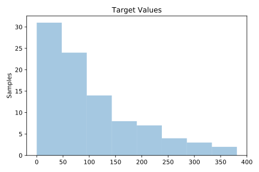
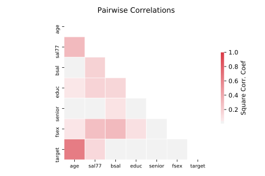

# 706_sleuth_case1202

[Metadata](metadata.yaml) | [Summary Statistics](summary_stats.csv)

## Summary

**task**: regression

**instances**: 93

**features**: 6

## Summary Plots

## Data Summary

|	variable	|	count	|	mean	|	std	|	min	|	25%	|	50%	|	75%	|	max|
| --- | --- | --- | --- | --- | --- | --- | --- | --- |
|	bsal	|	93	|	5420	|	709	|	3900	|	4980	|	5400	|	6000	|	8100
|	sal77	|	93	|	10392	|	1789	|	7860	|	9000	|	10020	|	11220	|	16320
|	fsex	|	93	|	0	|	0	|	0	|	0	|	1	|	1	|	1
|	senior	|	93	|	82	|	10	|	65	|	74	|	84	|	90	|	98
|	age	|	93	|	474	|	140	|	280	|	349	|	468	|	590	|	774
|	educ	|	93	|	2	|	0	|	0	|	2	|	2	|	3	|	4
|	target	|	93	|	100	|	90	|	0	|	35	|	70	|	144	|	381
