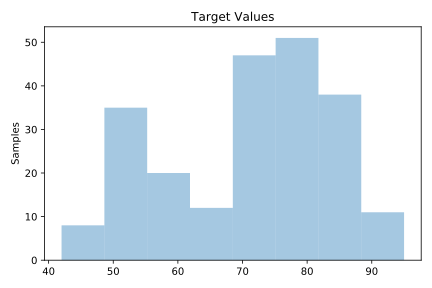
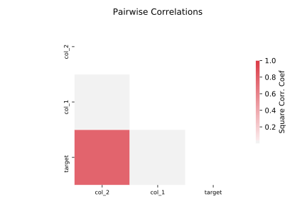

# 712_chscase_geyser1

[Metadata](metadata.yaml) | [Summary Statistics](summary_stats.csv)

## Summary

**task**: regression

**instances**: 222

**features**: 2

## Summary Plots

## Data Summary

|	variable	|	count	|	mean	|	std	|	min	|	25%	|	50%	|	75%	|	max|
| --- | --- | --- | --- | --- | --- | --- | --- | --- |
|	col_1	|	222	|	12	|	7	|	1	|	5	|	16	|	20	|	23
|	col_2	|	222	|	3	|	1	|	1	|	2	|	4	|	4	|	5
|	target	|	222	|	71	|	12	|	42	|	60	|	75	|	81	|	95
