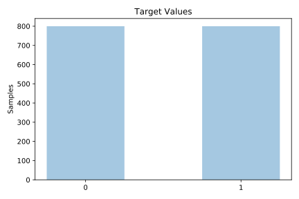
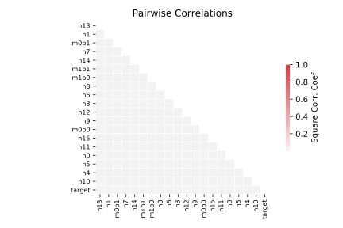

# GAMETES_Heterogeneity_20atts_1600_Het_0.4_0.2_50_EDM_2_001

[Metadata](metadata.yaml) | [Summary Statistics](summary_stats.csv)

## Summary

**task**: classification

**instances**: 1600

**features**: 20

**number of classes**: 20

## Summary Plots

## Data Summary

|	variable	|	count	|	mean	|	std	|	min	|	25%	|	50%	|	75%	|	max|
| --- | --- | --- | --- | --- | --- | --- | --- | --- |
|	N0	|	1600	|	0	|	0	|	0	|	0	|	1	|	1	|	2
|	N1	|	1600	|	0	|	0	|	0	|	0	|	0	|	1	|	2
|	N2	|	1600	|	0	|	0	|	0	|	0	|	0	|	0	|	1
|	N3	|	1600	|	0	|	0	|	0	|	0	|	1	|	1	|	2
|	N4	|	1600	|	0	|	0	|	0	|	0	|	0	|	0	|	2
|	N5	|	1600	|	0	|	0	|	0	|	0	|	0	|	1	|	2
|	N6	|	1600	|	0	|	0	|	0	|	0	|	0	|	0	|	2
|	N7	|	1600	|	0	|	0	|	0	|	0	|	1	|	1	|	2
|	N8	|	1600	|	0	|	0	|	0	|	0	|	0	|	0	|	2
|	N9	|	1600	|	0	|	0	|	0	|	0	|	0	|	0	|	2
|	N10	|	1600	|	0	|	0	|	0	|	0	|	0	|	0	|	2
|	N11	|	1600	|	0	|	0	|	0	|	0	|	0	|	0	|	2
|	N12	|	1600	|	0	|	0	|	0	|	0	|	1	|	1	|	2
|	N13	|	1600	|	0	|	0	|	0	|	0	|	1	|	1	|	2
|	N14	|	1600	|	0	|	0	|	0	|	0	|	1	|	1	|	2
|	N15	|	1600	|	0	|	0	|	0	|	0	|	0	|	1	|	2
|	M0P0	|	1600	|	0	|	0	|	0	|	0	|	0	|	1	|	2
|	M0P1	|	1600	|	0	|	0	|	0	|	0	|	0	|	1	|	2
|	M1P0	|	1600	|	0	|	0	|	0	|	0	|	0	|	1	|	2
|	M1P1	|	1600	|	0	|	0	|	0	|	0	|	0	|	1	|	2
|	target	|	1600	|	0	|	0	|	0	|	0	|	0	|	1	|	1
